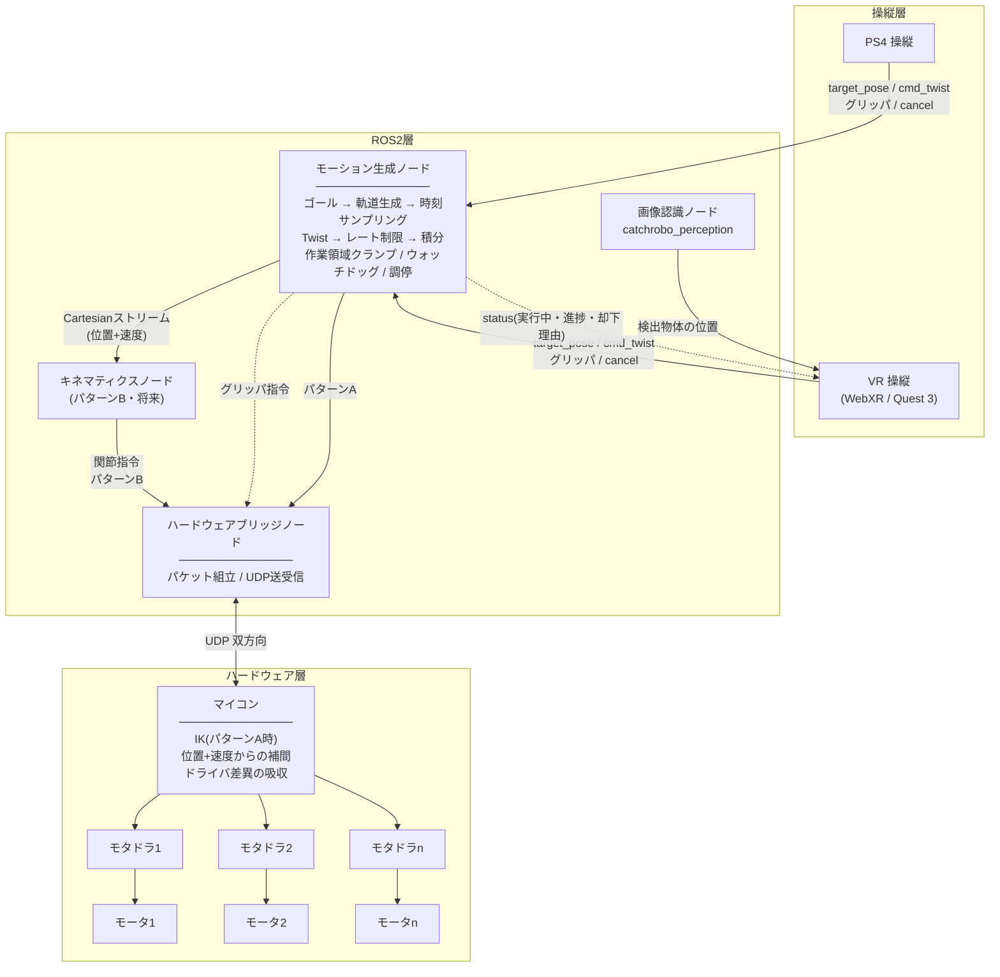

# sharmech

5節リンク機構を用いたピックアンドプレースロボットの ROS2 パッケージ群。
VR (WebXR / Meta Quest 3) と PS4 コントローラで操縦する。

> このドキュメントは設計の正本であり、ROS2 層のコードはこの設計どおりに**実装済み**です。
> 残作業 (MCU 側対応・実機合わせ) は[実装状況](#実装状況)を参照してください。

## 目次

- [レイヤー構成](#レイヤー構成)
- [アーキテクチャ](#アーキテクチャ)
- [ノード一覧](#ノード一覧)
- [トピック一覧](#トピック一覧)
- [決定済み(再検討不要)](#決定済み再検討不要)
- [MCU通信仕様 (UDP)](#mcu通信仕様-udp)
- [MCU側への要求事項](#mcu側への要求事項)
- [主要な設計判断とその理由](#主要な設計判断とその理由)
- [未決定事項](#未決定事項)
- [実装状況](#実装状況)
- [ビルドと起動](#ビルドと起動)

## レイヤー構成

役割として3層に分ける。**操縦層からハードウェア層へ直接は繋がず、必ず ROS2 層を経由する。**

| レイヤー | 役割 | 実行環境 | リポジトリ |
|---|---|---|---|
| 操縦層 | 操作入力 | ブラウザ(Quest) / PC | VR: 別リポジトリ<br>PS4: ROS2ワークスペース内 |
| ROS2層 | 調停・軌道生成・安全ロジック | Linux (soft real-time) | 本リポジトリ + `catchrobo_perception` |
| ハードウェア層 | モータ制御 | MCU (hard real-time) | `M5_Lower-Controller` |

層を分ける理由は、**タイミング領域が根本的に異なる**ため。操縦層は人間の知覚基準(数十Hz、ジッタに寛容)、ROS2層は非リアルタイムのLinux、ハードウェア層はサブミリ秒の決定性が要る。1プロセスに混ぜると設計が歪む。

ROS2層を必ず中間に置くのは、複数入力の調停・安全ロジックの一元化・ロギング資産の活用・異種プロトコル(WebSocket と UDP)の分離のため。

**担当分担**: 操縦層と ROS2 層は本リポジトリの担当。ハードウェア層は別担当者。
**E-stop はマイコン側と回路で実装するため、本アーキテクチャの対象外。**

## アーキテクチャ



### 中核となるデータフロー

ゴール指定とジョグ操作という性質の違う2つの入力を、**1本の Cartesian ストリームに合流させる**のが設計の要。合流点より下流はモードによらず共通になる。

```
ゴール指定 → 軌道生成 → 経過時間でサンプリング ┐
                                                ├→ Cartesianストリーム(位置+速度)
ジョグ(Twist) → レート制限 → 積分 → クランプ ──┘
                                                        ↓
                                    ┌───────────────────┴──────────────────┐
                              パターンA (現在)                       パターンB (将来)
                            そのままUDP送信                      IK → 関節位置+速度
                                    └───────────────────┬──────────────────┘
                                                        ↓
                                                UDP → マイコン
```

`game_state_manager_node` の自動配置シーケンスは、この図の「ゴール指定」の発生源が
人間の操縦層から自動シーケンサに変わるだけで、それ以降(軌道生成→経過時間サンプリング→
Cartesianストリーム)は既存経路をそのまま通る。詳細は
[`sharmech_core/docs/game_state_manager_node.md`](sharmech_core/docs/game_state_manager_node.md)。

## ノード一覧

| ノード | パッケージ | 役割 |
|---|---|---|
| `joy_teleop_node` | `sharmech_core` | `/joy` (PS4) を購読し、ゴール/速度指令に正規化 |
| `motion_generator_node` | `sharmech_core` | **中核**。軌道生成・速度積分・両モードの合流と調停・作業領域クランプ・ウォッチドッグ |
| `hardware_bridge_node` | `sharmech_core` | UDP 送受信、パケット組立 |
| `kinematics_node` | `sharmech_core` | パターンB用。**実装済み**。詳細は [`sharmech_core/docs/kinematics_node.md`](sharmech_core/docs/kinematics_node.md) |
| `game_state_manager_node` | `sharmech_core` | **実装済み**。「掴む→運ぶ→置く→退避」の自動配置シーケンスとゲーム全体の状態を管理。詳細は [`sharmech_core/docs/game_state_manager_node.md`](sharmech_core/docs/game_state_manager_node.md) |
| `cylinder_detector_node` | `catchrobo_perception` | フィールド上の物体位置を画像認識し `PoseArray` で配信。`scan_interval_sec` 周期の間欠スキャン + 手動トリガー |

### 軌道生成と速度積分を1ノードにまとめた理由

どちらも「現在の目標姿勢」という**同一の状態変数**を書き換える。ノードを分けるとこの状態が2箇所に分散し、モード切替時の引き継ぎが破綻する。状態を持つ主体は1つにする。

## トピック一覧

**VR クライアントは rosbridge 経由で直接これらのトピックを読み書きする。** 中継ノードは無い
(理由は[VR に中継ノードを置かない](#vr-に中継ノードを置かない)を参照)。

`rosbridge` 列が ○ のものが、ブラウザから見える契約。**この名前は WebXR クライアント側の
実装に合わせてある**ので、勝手に変えるとクライアントが動かなくなる。

| トピック | 型 | 方向 | rosbridge |
|---|---|---|---|
| `/catchrobo/arm/target_pose` | `geometry_msgs/PoseStamped` | 操縦層 / `game_state_manager_node` → `motion_generator_node` | ○ |
| `/catchrobo/arm/cmd_twist` | `geometry_msgs/Twist` | 操縦層 → `motion_generator_node` | ○ |
| `/catchrobo/arm/gripper` | `std_msgs/Bool` | 操縦層 / `game_state_manager_node` → `motion_generator_node` | ○ |
| `/catchrobo/arm/orient_vertical` | `std_msgs/Bool` | `game_state_manager_node` → `motion_generator_node`。PLACING中のみtrue | |
| `/catchrobo/arm/current_pose` | `geometry_msgs/PoseStamped` | `hardware_bridge_node` → 各ノード / WebXR | ○ |
| `/catchrobo/arm/mcu_status` | `sharmech_msgs/McuStatus` | `hardware_bridge_node` → 観測者 (疎通状態・`status_flags`・`seq`/`seq_echo`・連番逆転回数)。**latched** | ○ |
| `/catchrobo/arm/cancel` | `std_msgs/Empty` | 操縦層 → `motion_generator_node` | ○ |
| `/catchrobo/arm/status` | `sharmech_msgs/MotionStatus` | `motion_generator_node` → 操縦層 / WebXR / `game_state_manager_node`。**latched** | ○ |
| `/catchrobo/field/cylinders` | `geometry_msgs/PoseArray` | `cylinder_detector_node` → WebXR。**latched**、`scan_interval_sec`毎+手動トリガー | ○ |
| `/catchrobo/field/rescan_request` | `std_msgs/Empty` | WebXR → `cylinder_detector_node`。手動即時再スキャン | ○ |
| `/catchrobo/game/pick_request` | `geometry_msgs/PoseStamped` | WebXR → `game_state_manager_node`。選択したワーク姿勢 | ○ |
| `/catchrobo/game/box_count` | `std_msgs/Int32` | WebXR → `game_state_manager_node`。指定箱に置いた通算個数。`N` → `placement_order[N-1]` のスロットへ置きに行く | ○ |
| `/catchrobo/game/state` | `std_msgs/String` | `game_state_manager_node` → WebXR。**latched** | ○ |
| `/catchrobo/game/toggle_manual_control` | `std_msgs/Empty` | `joy_teleop_node` (4ボタン同時押し) / WebXR → `game_state_manager_node`。自由操作 (`MANUAL_CONTROL`) のトグル | ○ |
| `/catchrobo/game/confirm` | `std_msgs/Empty` | `joy_teleop_node` (確定ボタン) / WebXR (サムズアップ) → `game_state_manager_node`。微調整 (`ADJUSTING_PICK`/`ADJUSTING_PLACE`) の確定 | ○ |
| `/catchrobo/game/reset` | `std_msgs/Empty` | WebXR → `game_state_manager_node`。状態のリセット要求。どの状態からでも `INIT` へ入り、`init_pose` へ戻ってから `WAITING_FOR_PICK` に復帰する | ○ |
| `/catchrobo/game/workspace_clamp` | `sharmech_msgs/WorkspaceClamp` | `game_state_manager_node` → `motion_generator_node` | |
| `/catchrobo/debug/change_state` | `std_msgs/String` | デバッグ用 → `game_state_manager_node`。ステートを強制遷移させる (その状態の目標姿勢は配信しない) | ○ |
| `/catchrobo/command/cartesian` | `sharmech_msgs/CartesianCommand` | `motion_generator_node` → 下流 | |
| `/catchrobo/command/joint` | `sensor_msgs/JointState` (`name`=5モータ個別名) | `kinematics_node` → `hardware_bridge_node` (`command_mode: "joint"`、packet_type=0x02。2026-09-01 接続済み。`pattern_b:=true` 時のみ流れる) | |
| `/catchrobo/command/gripper` | `std_msgs/Bool` | `motion_generator_node` → `hardware_bridge_node` | |
| `/catchrobo/command/orient_vertical` | `std_msgs/Bool` | `motion_generator_node` → `hardware_bridge_node` | |
| `/joy` | `sensor_msgs/Joy` | joy ドライバ → `joy_teleop_node` | |
| `/joint_states` | `sensor_msgs/JointState` | `hardware_bridge_node` → `robot_state_publisher` | |

名前空間で段階を分けている。

| 名前空間 | 意味 |
|---|---|
| `/catchrobo/arm/` | 操縦層に面した層。**調停前の生の入力**。VR と PS4 の両方がここへ publish する |
| `/catchrobo/command/` | 調停・軌道生成を経た**確定した指令**。`hardware_bridge_node` へ渡る |
| `/catchrobo/field/` | 画像認識の出力 |

### Action を使わない

**ゴール指定もキャンセルも状態確認も、すべてトピックで行う。** 当初はゴールを Action
(`MoveToPose`) で受ける設計だったが、`/catchrobo/arm/status` を入れた時点で Action の
役割が無くなったため廃止した。

| Action が答えていた問い | 代替 |
|---|---|
| 私のゴールは成功したか | `status.last_result` |
| 却下されたか・理由は | `status.last_result` / `status.message` |
| 今実行中か・あと何秒か | `status.mode` / `status.time_remaining` |
| キャンセル | `/catchrobo/arm/cancel` |

**状態トピックの方が優れている点が4つある。**

1. **再接続に強い。** VR クライアントは自動再接続する。Action 実行中に WebSocket が切れると
   result が失われるが、latched な状態トピックは再接続時に現在状態が即座に届く
2. **誰が指令したかに関わらず見える。** VR で見ている人は PS4 由来の動作も知るべき。
   Action の feedback は自分が送ったゴールしか教えてくれない
3. **観測者が何人でもよい。** デバッグ用ダッシュボードや `catchrobo_app` が後から購読できる
4. **ゴール経路が1本になる。** Action とトピックを併存させると「Action なら reject が返るが
   トピックなら返らない」という非対称を抱え込む。1本なら **VR と PS4 が完全に等価**になる

「実行中」は**イベントではなく状態**なので状態として流す。グリッパで `Empty` 2本ではなく
`Bool` 1本を選んだのと同じ理由。

ブラウザ側に Action Client の実装を要求しないという当初の目的も、そのまま満たされる。

**将来 Action が欲しくなる場面**として想定していた自律動作の順序制御(掴む→運ぶ→置くを
上位ノードが順に実行し、各段の完了を待つ)は、`game_state_manager_node` の追加で実際に
到来した。しかしそのときも Action は導入しなかった。`/catchrobo/arm/status.last_result`
の変化を購読して次のゴールを送るだけで、Action の feedback/result 相当の役割を既存の
状態トピックがそのまま果たせている。詳細は
[`sharmech_core/docs/game_state_manager_node.md`](sharmech_core/docs/game_state_manager_node.md)
の「Action を使わない」を参照。

### グリッパの経路

グリッパは運動学を通らない量だが、**全ての操縦指令を単一の調停点に通す**ため
`motion_generator_node` を経由させる。VR / PS4 のどちらから来た指令も同じ扱いになる。

### 独自メッセージ (`sharmech_msgs`・新規パッケージ)

```
# MotionStatus.msg
std_msgs/Header header
uint8   mode                  # 0=IDLE, 1=GOAL, 2=JOG
geometry_msgs/Pose goal_pose
float64 distance_remaining
float64 time_remaining
uint8   last_result           # 0=none 1=succeeded 2=aborted 3=rejected
string  message
```

```
# CartesianCommand.msg
std_msgs/Header header
geometry_msgs/Pose  pose
geometry_msgs/Twist twist
```

`geometry_msgs/PoseStamped` ではなく独自型にするのは、**速度を一緒に運ぶため**。
`motion_generator_node` は速度を既に知っている(軌道生成なら速度プロファイルから、ジョグなら Twist そのもの)ので、捨てずに流す。下流での数値微分を避けられる。

### 座標系

**`field` 座標系 = ロボットのベース座標系。完全に一致させる。** 原点はアームの根元。
一致させてあるので座標変換は一切不要で、TF も要らない。

- **Twist はベース座標系基準。** スティックを倒した方向がロボットの前後左右に対応し、
  先端の向きに依存しない
- **WebXR ↔ ROS の基底変換はクライアント側で完結している。**
  `catchrobo_webxr_controller/src/field.js` の `worldToRosPose` / `rosPoseToLocal` が担当し、
  `scripts/coords.mjs` で往復一致を検算済み。**ROS2 側は一切変換しない**

## 決定済み(再検討不要)

- **VR / PS4 の入力調停は行わない。** 両方を同時に使うことはないため、
  「早い者勝ち」のままでよい
- **経由点を持つ軌道は作らない。** 一連の動作(掴む→持ち上げる→運ぶ→置く等)は
  各段階で一旦止まってよく、操縦層が複数のゴールを順番に送る。
  `motion_generator_node` は直線1本の軌道生成のみでよい
- **CRC は入れない。** UDP チェックサムに委ねる。シンプルな実装を優先し、必要になったら追加する

## MCU通信仕様 (UDP)

> **MCU担当者に渡す仕様書 (契約の正本) は [`docs/mcu_spec.md`](docs/mcu_spec.md)。**
> パケットのバイトレイアウト・タイミング・異常系の振る舞いはそちらが優先する。
> 本節は設計の背景・理由づけの説明として残している。

**物理接続は有線 Ethernet。制御周期は 100Hz。**

有線でも **UDP を使う**。TCP は再送とヘッドオブラインブロッキングがあり、古いデータの再送を
待つ間に新しい指令が届かなくなる。リアルタイム制御では「古いデータは捨てて新しいものを使う」
のが正しい。

100Hz で足りる根拠: マイコンが速度で線形外挿する際の誤差は `½ × a_max × dt²` で、
`a_max = 0.2 m/s²`・`dt = 10ms` なら **0.01mm**。`a_max` を 25 倍の 5 m/s² にしても 0.25mm。
レートを上げる必要はなく、Ethernet の余裕は**外れ値への耐性**として使う。

リトルエンディアン、パディングなしのパック構造体。x86 も STM32 (Cortex-M) もリトルエンディアンなので変換不要。

### 共通ヘッダ (16 バイト)

| offset | 型 | 名前 | 説明 |
|---|---|---|---|
| 0 | `uint8` | `protocol_version` | 現在 1 |
| 1 | `uint8` | `packet_type` | **1 = Cartesian、2 = 関節 (パターンB)** |
| 2 | `uint16` | `payload_length` | ペイロード長 |
| 4 | `uint32` | `seq` | 送信ごとに +1 |
| 8 | `uint64` | `timestamp_us` | 送信時刻 [μs] |

`packet_type` を最初から持たせるのは、**パターンB追加を破壊的変更にしないため**。プロトコルは他人(MCU担当者)との契約なので、後から変えるコストが最も高い。

### ペイロード: `packet_type = 1` (Cartesian) — 44 バイト

| offset | 型 | 名前 | 単位 |
|---|---|---|---|
| 16 | `float32` | `x` | m |
| 20 | `float32` | `y` | m |
| 24 | `float32` | `z` | m |
| 28 | `float32` | `pitch` | rad |
| 32 | `float32` | `yaw` | rad |
| 36 | `float32` | `vx` | m/s |
| 40 | `float32` | `vy` | m/s |
| 44 | `float32` | `vz` | m/s |
| 48 | `float32` | `pitch_rate` | rad/s |
| 52 | `float32` | `yaw_rate` | rad/s |
| 56 | `uint8` | `gripper` | 0=開, 1=閉 |
| 57 | `uint8` | `control_flags` | bit0: 動作許可, bit1: 縦にする指示 (`game_state_manager_node` のPLACING時のみ) |
| 58 | `uint16` | `reserved` | 将来用・0埋め |

**合計 60 バイト。**

`float32` を使う理由: 作業領域が 1m 以下なら精度は 0.1μm 相当で必要精度を大きく上回る。STM32 は 32bit MCU で、FPU付きの品種なら `float32` がネイティブ、`double` はソフトウェアエミュレーションで遅い。

### 送信例

```
protocol_version = 1        packet_type = 1        payload_length = 44
seq = 100                   timestamp_us = 1724400000123456

x     =  0.0500      vx         =  0.0667
y     =  0.2000      vy         =  0.0667
z     =  0.0750      vz         = -0.0333
pitch =  0.1000      pitch_rate =  0.1333
yaw   =  0.2000      yaw_rate   =  0.2667

gripper = 0          control_flags = 0x01
```

### ペイロード: `packet_type = 2` (関節、パターンB) — 44 バイト

`command_mode: "joint"` のときに 0x01 の代わりに送られる (同時には送らない)。
0x01 と同じ「位置と速度の併送」原則。関節数は**5固定** (このロボット専用の契約
なので可変長にしない。2026-09-01 ユーザー確定)。

| offset | 型 | 名前 | 単位 |
|---|---|---|---|
| 16 | `float32[5]` | `q` | rad |
| 36 | `float32[5]` | `qdot` | rad/s |
| 56 | `uint8` | `gripper` | 0=開, 1=閉 (0x01 と同一) |
| 57 | `uint8` | `control_flags` | 0x01 と同一のビット定義 |
| 58 | `uint16` | `reserved` | 将来用・0埋め |

**合計 60 バイト (0x01 と同サイズ。`gripper`/`control_flags` のオフセットも同一
なので、MCU側はこの2フィールドの処理を共通化できる)。**

**関節の並び順 (契約):**

```
q[0] = shoulder_left    肩・左モータ
q[1] = shoulder_right   肩・右モータ
q[2] = turntable        ターンテーブル
q[3] = knee_left        肘/膝・左モータ
q[4] = knee_right       肘/膝・右モータ
```

この順序は `kinematics_node` が publish する `/catchrobo/command/joint` の `name` 順、
および 0x81 フィードバックの `joint_positions[]` と**同一** (ROSトピック・UDP指令・
UDPフィードバックの3箇所で1つの順序。定義は `udp_protocol.hpp` の `kJointOrder`)。

### 戻り (マイコン → ROS2): `packet_type = 0x81`

ヘッダは送信と共通。方向の区別を明確にするため、**フィードバックは `0x80` 以上**を使う。

| 内容 | 型 | 用途 |
|---|---|---|
| `seq_echo` | `uint32` | 最後に受信した指令の `seq`。往復遅延の測定 |
| `x, y, z, pitch, yaw` | `float32` × 5 | 実姿勢。**MCU 側で FK して返す** |
| `status_flags` | `uint16` | bit0: 追従誤差過大 / bit1: ドライバ異常 / bit2: ウォッチドッグ作動中 / bit3: 未初期化・原点未確定 / bit4: 直近指令を破棄した (作業領域外・seq逆転等。破棄後しばらく立てておく) |
| `gripper_state` | `uint8` | 実際のグリッパ状態 |
| `joint_count` + `joint_positions[N]` | `uint8` + `float32[N]` | 実測の関節角。診断と rviz 表示用。**並び順は 0x02 の `q[]` と同一** (上記「関節の並び順」) |

関節数 6 なら合計 68 バイト。バイトオフセットの詳細は
[`sharmech_core/docs/hardware_bridge_node.md`](sharmech_core/docs/hardware_bridge_node.md) を参照。

**MCU 側が FK を行う。** 到達判定と VR への表示に必要なのは Cartesian 姿勢だが、MCU が持っているのは
エンコーダ由来の関節角。パターンA では MCU が既に運動学 (IK) を持っているので FK も MCU 側で行い、
「ROS2 は運動学を持たない」という原則を保つ。

**送信条件 (2026-09-01 確定): フィードバックは指令の受信と無関係に、MCU起動直後から
一定周期 (100Hz) で自発送信する。** 指令へのエコー型にはしない。これにより
①ROS2 起動時の「目標姿勢を実姿勢へ同期する」処理が最初のゴール受理前に確実に走る、
②「MCUが死んだ」と「ROS2 が送っていない」を ROS2 側で区別できる、
③ウォッチドッグ発動・未初期化などの状態が指令を送らなくても見える。
原点未確定の間は `status_flags` bit3 (未初期化) を立てたまま送ること。
有線 Ethernet・68バイト×100Hz ≈ 54kbps なので帯域は問題にならない。

## MCU側への要求事項

**パケット仕様と同等に重要。** これを伝えないと素朴な実装になり、動きが荒れる。

1. **`packet_type` を見て分岐する構造にする**(パターンAなら `1` のみ実装でよい。
   パターンBで繋ぐ場合は `2` も。ROS2側はどちらのモードでも一方だけを送る)
2. **位置をそのままドライバに渡さず、速度を使って自分の制御周期で補間する** — 詳細は下記
3. **次のパケットが一定時間(推奨 50ms 程度)来なければ外挿をやめ、最後の目標位置を
   ホールドする(サーボONのまま位置保持。脱力しない)** — 2026-09-01確定。
   v_max=0.1m/s と遅いので即時ホールドでも衝撃は小さい。脱力するとアームが自重で
   落ちてワーク破損(-1点)のリスクがある。電源遮断が必要な異常はハードE-stopの担当。
   ストリームが再開したら自動で追従に復帰してよい(下記8のスルーレート制限が効くため
   復帰時のジャンプは起きない)
4. **`seq` の逆転を検出したら古いパケットを破棄する**(UDP は順序保証がない)。
   破棄したら `status_flags` bit4 を一定時間(目安200ms)立てて通知する
5. **受信値が作業領域外なら破棄する**(通信化けとバグの両方を防げる)。
   これも破棄したら bit4 で通知する
6. ドライバごとの制御方式の差異(ODrive / DJI C610 / Feetech)は**すべてマイコン側で吸収する**。ROS2 側はハードウェア構成を知らない
7. **`control_flags` bit1 が立っている間、横倒しのワークを縦向きにしてから置く動作を行う**
   (`game_state_manager_node` が置く直前(PLACING)にのみ立てる)。ROS2 側はこれを
   不透明な1ビットとして渡すだけで、**どんな機構・アクチュエータで実現するかは
   MCU側の設計判断**(グリッパへの追加機構、手首の回転等)。現時点では機構自体が
   未確定・未実装 (2026-08-29時点)
8. **常に自前のスルーレート制限(速度・加速度上限)をかけて追従し、指令位置へジャンプ
   しない** — 2026-09-01確定。起動直後・ROS2再起動後は指令位置と実位置が大きく
   ずれていることがあり、そのとき無制限に追従すると危険な高速移動になる。
   スルーレート上限は ROS2 側の `v_max`/`a_max` (config.yaml。現在 0.1m/s / 0.2m/s²)
   より**大きく**設定すること(でないと通常の追従までなまる)
9. **フィードバック(0x81)は起動直後から100Hzで自発送信する**(上記「送信条件」参照)。
   指令へのエコー型にしない
10. `timestamp_us` は診断用(往復遅延・ジッタの測定)。**MCU側は無視してよい**。
    時刻同期は要求しない。補間に使う時間はMCU自身のクロックで測ること
11. `gripper` / `control_flags` は毎パケットに載る**状態(レベル)であってイベント
    (エッジ)ではない**。パケットを取りこぼしても次のパケットで正しい状態に回復する。
    「開→閉に変わった瞬間」を検出したい場合はMCU側で前回値と比較する
12. `control_flags` bit0 (動作許可) が 0 のパケットを受けたら、ウォッチドッグ発動時と
    同じ挙動(最後の目標位置をホールド)を取ること。**現状 ROS2 は常に 1 を送る**
    (将来のソフト側サーボ停止経路としての予約)

### 要求2(補間)が必要な理由

**モータドライバは時間の概念を持たない。** 偏差を見て全力で詰めにいくだけで、「10ms 後に到達しろ」とは誰も言っていない。以下の3条件が揃うと問題になる。

1. 指令の更新が粗い (100Hz なら 10ms に1回)
2. ドライバの応答が速い (0.4度程度の偏差なら数 ms で詰めてしまう)
3. ドライバに時間の概念がない

結果、**「速く動いて → 待つ」を毎秒100回繰り返す**。

```
0-2ms   全力で追いつく    瞬間速度 約 267°/s
2-10ms  偏差ゼロで待機    瞬間速度 0
```

平均速度は軌道の意図通りだが、瞬間速度は 100Hz の矩形波になる。可聴域の振動として現れ、機構にも負担がかかる。

**位置+速度を受け取り、次のパケットまでマイコンが自分のループ周期で目標値を進める**ことで解決する。

```c
// 制御ループ(1kHz)ごと
target_x += vx * dt;
target_y += vy * dt;
// ...
```

これは ROS2 の `joint_trajectory_controller` や CANopen/EtherCAT (DS402) の補間位置モードと同じ考え方。**遅い非リアルタイム領域から速いリアルタイム領域へ指令を渡すとき常に発生する問題**であり、補間器は通信路の**下流**に置く必要がある。

## 主要な設計判断とその理由

### 位置と速度を常に併送する

役割が異なるため、どちらも省けない。

| | 役割 | パケットが落ちたら |
|---|---|---|
| **位置** | 毎パケット、絶対値で再同期する | 次のパケットで復帰。誤差は蓄積しない |
| **速度** | 次のパケットまでの隙間を埋める | その 10ms だけ補間が甘くなる。持続しない |

速度のみを送ると積分誤差が**永久に蓄積する**。パケットロス 1% で 5 秒の動作なら約 5mm ずれ、動作のたびに積み上がる。位置のみを送ると補間ができずゼロ次ホールドになる(上記の矩形波問題)。

### ヤコビ行列(リゾルブドレート制御)を使わない

一般にジョグ操作の標準手法は `q̇ = J⁻¹(q)·v` による関節速度への直接変換(MoveIt Servo が該当)。IK を挟まないため解の飛び移りがなく、特異点処理・冗長性解決も自然に行える。

**それでも採用しないのは、パターンA(マイコン側でIK)では ROS2 が運動学を持たないため。** ROS2 が出力できるのは Cartesian 姿勢だけなので、Twist からの変換は積分しかない。

このロボットでは弊害が小さい。x-y は5節リンク、z は独立、pitch/yaw は手首と**自由度がほぼ分離**しており、一般的な6軸垂直多関節のような特異姿勢での暴れが起きにくい。5節リンクの特異点は作業領域の縁にあるため、作業領域制限が保護を兼ねる。

### 時間軸は ROS2 が持つ(ストリーミング)

両モードを1本のストリームに合流させた結果、**必然的にストリーミングになる**。軌道を一括転送してマイコンに再生させる方式(ROS2 の `joint_trajectory_controller` 相当)は、ジョグ操作に終点が存在しないため合流と両立しない。

パケットに時刻は入っているが、**時間軸を決めるのは「いつ送るか」という送信タイミングそのもの**。したがってタイミング精度は ROS2 の送信周期の正確さと通信の揺らぎに直接依存する。実装一本化との引き換え。

> **実装上の罠**: 軌道をサンプリングするとき、配列のインデックスを1つずつ進めてはならない。
> 必ず**経過時間を見て軌道を評価する**。インデックスを進めると軌道が持つ時間情報が失われ、
> 距離に関係なく常に同じ時間で走り切ることになり、速度プロファイルが完全に無意味になる。

### ros2_control を使わない

`ros2_control` + `joint_trajectory_controller` は「補間は上位側でやる」思想で、マイコンを単純な機構にできる。ただし**これが成立するのは通信路が決定的な場合のみ**(EtherCAT など)。

補間した後にネットワークを通ると補間の意味が失われる。1kHz で UDP を流し続けること自体も非現実的。Linux は普段 ±1ms でも時々 10ms 以上止まるため、その瞬間に目標が固まって復帰時にジャンプする。マイコン側で補間していれば同じ空白を速度で外挿して埋められる。

**平均性能ではなく外れ値への耐性が違う**というのが本質的な差。マイコン側の補間は数行で済むため、robustness が安く買える。

### VR に中継ノードを置かない

当初は `vr_bridge_node` を置いて座標変換と入力検証をする設計にしていたが、**不要と判断して
削除した。** WebXR クライアント側が既に全部やっている。

| 想定していた仕事 | 実際 |
|---|---|
| WebXR ↔ ROS2 座標変換 | `src/field.js` の `worldToRosPose` / `rosPoseToLocal` で完結。`scripts/coords.mjs` で検算済み |
| 入力検証 | `config.js` の `TARGET_GUARD` がフィールド外マージン・高さ範囲・誤爆防止の長押し(400ms)を持つ。加えて `motion_generator_node` でも作業領域クランプと goal reject をやるので二重 |
| 型の変換 | クライアントは最初から `geometry_msgs/PoseStamped` を `frame_id: 'field'` で publish している |

**中継ノードを挟むと、変換が二重になるか、片方が死んだコードになる。** rosbridge は
ROS2 グラフへの直接の窓なので、クライアントを「ROS2 ノードの一種」として扱えばよい。

残る差分はゴール指定に Action を使うかどうかだけだったが、これは
[Action を使わない](#action-を使わない)ことで消えた。

### ジョグ操作に固有の3つの対処

ゴール指定には無く、速度入力にのみ必要。

1. **加速度制限** — スティックを一気に倒すと速度が不連続に跳ぶ(加速度無限大)。ゴール指定時の台形プロファイルに相当する保護が無いため、ROS2 側でレート制限をかける。**`a_max` はゴール指定と共用**し、両モードの動作感を揃える
2. **作業領域クランプ** — 積分は何も知らずに進み続けるため、毎周期クランプし境界方向の速度成分を捨てる
3. **ウォッチドッグ** — 通信断・電池切れ・ブラウザのフリーズで入力が止まったとき、**最後の速度で走り続けてはならない**。300〜500ms(既定 400ms 程度)Twist が届かなければ速度を 0 とみなす

### パターンB を将来追加するための備え

追加時に**既存ノードの改造が不要**になるよう、以下を先に用意した。

| 備え | 理由 | 状態 |
|---|---|---|
| Cartesian ストリームをトピックとして公開 | `kinematics_node` が後から購読するだけで繋がる | 完了。`kinematics_node` が実際に購読している |
| `packet_type` をヘッダに持つ | プロトコル変更が追加的になる | 定義済み (`packet_type = 0x02`) |
| パケット組立をエンコーダとして抽象化 | 実装クラスを1つ足すだけで済む | 未着手 (`UdpProtocol::encodeJoint` がまだ無い) |

`motion_generator_node` は**パターンA/Bのどちらでも変更不要**。両モードを1本のストリームに合流させた設計の副産物。

2026-08-27、ロボット構成 (5軸パラレルリンク。座標のみ確定) がユーザーから確認され、
`kinematics_node` を実装した (詳細は [`sharmech_core/docs/kinematics_node.md`](sharmech_core/docs/kinematics_node.md))。
残る作業は `UdpProtocol::encodeJoint` の追加と `hardware_bridge_node` の `command_mode: "joint"`
実装のみ。またロボットのリンク長等の実測値がまだ無いため、launch では `pattern_b` 引数で
既定無効にしてある。

## 未決定事項

| 項目 | 内容 | 影響 |
|---|---|---|
| ウォッチドッグ発動時の減速度 | `a_max` で減速すると全速から停止まで 0.5s / 2.5cm 進む。即時 0 にすると加加速度が無限大 | 安全性と機構への負担のトレードオフ |
| `joint_names` の値と順序 | MCU が返す `joint_positions` の並びと一致させる必要がある | 関節構成の確定待ち |
| フィードバック途絶時の停止 | 現状は警告のみ。自動停止させるべきか | 安全 |
| 動作許可の制御経路 | パケットにフィールドは確保済みだが、**現時点では常に 1 を入れる**。サーボ ON/OFF が必要になった時点でサービス等を追加 | プロトコル |
| `/catchrobo/command/joint` の型 | 関節構成の確定待ち | パターンB |
| `motion_generator_node` の作業領域パラメータ (`workspace_z_min/max`) | X/Yは2026-08-30の実測(赤フィールド)で確定済み(詳細は `sharmech/docs/field_dimensions.md`)。**Zのみ未確定のまま** | 安全・実用性。VR/PS4からの実際の指令がこの範囲外だと全て却下される |
| 「相手チームエリア・進入禁止エリアへの侵入禁止」ルールへの対応 | ルールブック上、上空含め侵入すると違反・失格の対象。今の作業領域クランプ(軸並行の箱)だけで守れるかは要検討 | 「禁止区域」機能([主要な設計判断](#主要な設計判断とその理由)で検討済みの拡張)が実際に必要になる可能性がある |

### 経由点についての注意

複数点を直線で繋ぐと、**経由点で速度が不連続になる**。位置は連続でも進行方向と速さが同時に変わるため、加速度が跳ね上がり実機が追従できない。

対策は経由点の厳密な通過を諦め、**手前から曲がり始めて滑らかに繋ぐ**こと(産業用ロボットの「コーナリング」「ブレンド半径」)。必要になった時点で軌道生成の作りが変わる。

## 実装状況

上記アーキテクチャの ROS2 層は**実装済み**。ノード詳細は `sharmech_core/docs/` を参照。

| ノード | 状態 |
|---|---|
| `motion_generator_node` | 実装済み。旧 `state_manager_node` + `trajectory_generator_node` を置き換え |
| `joy_teleop_node` | 実装済み (新規) |
| `hardware_bridge_node` | 実装済み (プロトコル v1・送受信対応) |
| `kinematics_node` | パターンB。実装済み (IKのみ。`hardware_bridge_node`側`joint`モード未実装のため実機未接続) |
| `game_state_manager_node` | 実装済み (新規)。自動配置シーケンス・ゲームステート管理。シューティングボックスのスロット座標は要CAD実測の仮値のまま |
| `sharmech_msgs` | 実装済み (`CartesianCommand` / `MotionStatus` / `WorkspaceClamp`) |

旧構成のノード (`vr_interface_node` / `state_manager_node` / `trajectory_generator_node` /
旧 `kinematics_node`) と `coordinate_converter.hpp` / `trajectory_utils.hpp` は削除済み。
`five_bar_kinematics.hpp` はパターンB 用に残置 (forwardKinematics は近似実装のまま)。
実際に `kinematics_node` が使う運動学は別ヘッダー `parallel_arm_kinematics.hpp`
(2026-08-27 ロボット構成確認後に新規追加。厳密解)。

残作業:

- MCU 側ファームウェアの対応 (別担当者)。それまで `/catchrobo/arm/current_pose` は流れない
- `home_pose` と PS4 の軸・ボタン番号の実機合わせ (config.yaml)
- パターンB実機接続 (`UdpProtocol::encodeJoint` の追加、`hardware_bridge_node` の
  `command_mode: "joint"` 実装) と、`kinematics_node` のリンク長等の実測
- `game_state_manager_node` のシューティングボックスのスロット座標 (赤/青とも仮値) の
  CAD実測、およびグリッパの実フィードバック配線 (現状は grasp判定が時間待ちの暫定実装。
  詳細は [`sharmech_core/docs/game_state_manager_node.md`](sharmech_core/docs/game_state_manager_node.md))
- `control_flags` bit1 (「縦にする」指示) を実際に受けてワークを立てる機構自体が
  MCU側で未確定・未実装
- VR側 (`catchrobo_webxr_controller`) の `/catchrobo/game/pick_request`
  `/catchrobo/field/rescan_request` の送信ロジック実装 (本リポジトリのスコープ外)。
  `/catchrobo/game/box_count` はVR側実装済み。ただし `pick_request` が無いと
  自動シーケンスが始まらないため、box_countだけでは実機は動かない

## ビルドと起動

```bash
cd ~/catchrobo_ros2_ws
source /opt/ros/humble/setup.bash
rosdep install --from-paths src --ignore-src -r -y
colcon build --symlink-install
source install/setup.bash
```

```bash
# 本体。field_color はデフォルト値を持たせていないため必須 (red/blue)。
# シューティングボックスのスロット座標が赤/青で異なるため、指定を忘れると
# ノードが起動時エラーになる (独断で選ばせない設計。詳細は
# sharmech_core/docs/game_state_manager_node.md)
ros2 launch sharmech_bringup sharmech.launch.xml field_color:=red
ros2 launch sharmech_bringup sharmech.launch.xml field_color:=red rviz:=true

# VR クライアントと通信する場合 (rosbridge, port 9090)
ros2 launch sharmech_bringup rosbridge.launch.xml
```

パラメータは `sharmech_bringup/config/config.yaml` で一元管理。
