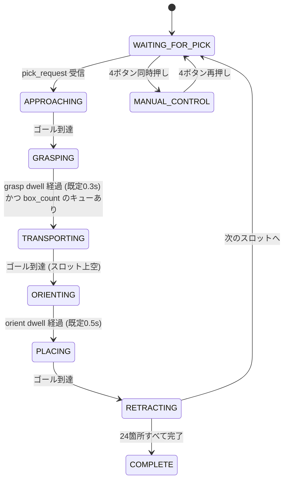

# game_state_manager_node

「掴む→運ぶ→置く→退避」の自動配置シーケンスと、ゲーム全体の状態を管理する中核ノード。
**実装済み** (`src/game_state_manager_node.cpp`)。状態遷移の純粋ロジックは
`include/sharmech_core/utility/game_state_machine.hpp` (`GameStateMachine`) に切り出してあり、
本ノードはそこへ ROS トピックの入出力を橋渡しするだけ。

全体アーキテクチャは [`sharmech/README.md`](../../README.md) を参照。

## 背景・やりたいこと

VR の仮想フィールドでオペレータがワークを「掴んで」「置きたい場所(仮想の置き場フィールド)」
へ置くと、実機は以下を自動で行う。

1. 選択されたワークの実姿勢へ接近する
2. グリッパを閉じて把持する
3. 安全な高さまで持ち上げて運搬する
4. VR の指定箱に「何個目を置いたか」(`box_count`) が届いていれば、そのスロットの
   上空へ運び、到達したら直線1本で降下し、必要なら「縦にする」指示を MCU へ
   送りながら設置する
5. 箱にぶつからない高さまで退避する
6. 次のスロットへ進み、1に戻る (24箇所すべて埋まったら完了)

シューティングボックスは4箱×6箇所=24箇所。**どの位置に何番目に置くか**を
`placement_order` (スロットIDの配列) で持ち、スロットIDごとの座標は
`slot_x/y/z_<color>` で持つ。**何個目まで置くかは VR の
`/catchrobo/game/box_count` が決める** (`box_count = N` → `placement_order[N-1]`
のスロットへ。下記「box_count とスロットのキュー」)。フィールドの色 (赤/blue) によってスロット座標が
異なるため、`field_color` は起動時に launch 引数で明示指定する
(詳細は下記「なぜ launch 引数を必須にするか」)。

## 役割

| 役割 | 詳細 |
|---|---|
| 状態管理 | `GameState` enum で管理し、`/catchrobo/game/state` (string, latched) に配信する |
| 自動シーケンス | 各状態1本の直線ゴールを `/catchrobo/arm/target_pose` へ順に publish する |
| 安全性 | PLACING/RETRACTING 中だけ作業領域クランプをスロット周辺に一時的に絞る |

### やらないこと

| やらないこと | 担当 |
|---|---|
| 軌道生成・速度積分・作業領域クランプの実行・ウォッチドッグ | `motion_generator_node` (このノードは`/catchrobo/game/workspace_clamp`でクランプの範囲を指示するだけ) |
| UDP 送受信・MCU との通信 | `hardware_bridge_node` |
| ワークの検出・スキャン | `catchrobo_perception` (`cylinder_detector_node`)。本ノードはpick_requestで完成済みの姿勢を受け取るだけ |
| VR の仮想フィールド描画・オブジェクトの掴む/置く操作・向き変更用の「置き場フィールド」UI | **WebXR クライアント側**(別リポジトリ、実装は本ノードのスコープ外)。本ノードはそこから届くトピックの契約(下記)を満たすのみ |

## インターフェース

### Subscribe

| トピック | 型 | 説明 |
|---|---|---|
| `/catchrobo/game/pick_request` | `geometry_msgs/PoseStamped` | VR の仮想フィールドで選択したワークの姿勢。**`kWaitingForPick` 状態でのみ有効** |
| `/catchrobo/game/box_count` | `std_msgs/Int32` | VR の指定箱にワークを離した**通算個数**(1始まり)。`N` は「`placement_order[N-1]` のスロットへ置きに行く」を意味する。**置きに行くべきスロットのキュー**として扱い、`place_request` 相当の「置け」指示も兼ねる(下記) |
| `/catchrobo/arm/status` | `sharmech_msgs/MotionStatus` | `motion_generator_node` の状態。`last_result` の変化でゴール到達/却下を検知する |
| `/catchrobo/game/toggle_manual_control` | `std_msgs/Empty` | `joy_teleop_node` が DualSense の4ボタン同時押しを検知して publish。**どの状態からでもトグルできる** (下記「自由操作」節) |
| `/catchrobo/debug/change_state` | `std_msgs/String` | デバッグ専用。状態名 (`"APPROACHING"` 等) を受けて `forceState()` で強制的にその状態へ飛ばす。ゴール・グリッパ・クランプは一切 publish しない (その状態の見た目だけを確認したいとき用)。未知の状態名は無視して警告ログを出す |

`pick_request` の型を `PoseStamped` にしたのは、VR は既に `/catchrobo/field/cylinders`
(`cylinder_detector_node` の出力) から選んだ姿勢をそのまま持っているため。インデックス指定
方式にすると本ノードが検出結果を保持する必要が生じ、責務が増える。

### Publish

| トピック | 型 | 説明 |
|---|---|---|
| `/catchrobo/arm/target_pose` | `geometry_msgs/PoseStamped` | 自動シーケンスのゴール。**既存の VR/PS4 と同じトピックに直接 publish する**(下記) |
| `/catchrobo/arm/gripper` | `std_msgs/Bool` | 自動シーケンスのグリッパ指令 |
| `/catchrobo/arm/orient_vertical` | `std_msgs/Bool` | PLACING 中のみ `true` |
| `/catchrobo/game/workspace_clamp` | `sharmech_msgs/WorkspaceClamp` | PLACING/RETRACTING 前後の作業領域クランプ上書き。詳細は [`motion_generator_node.md`](motion_generator_node.md) |
| `/catchrobo/game/state` | `std_msgs/String` | 現在のゲームステート。**latched (transient_local)**、`state_publish_rate` (既定10Hz) |

### パラメータ

| パラメータ | 既定値 | 説明 |
|---|---|---|
| `field_color` | (既定値なし。**必須**) | `"red"` / `"blue"`。launch 引数 `field_color:=` で指定。他の値ならノード起動失敗 |
| `slot_x_red` / `slot_y_red` / `slot_z_red` | 2026-08-30実測 (X/Yのみ確定) | 赤フィールドのスロット座標。等長配列、インデックス=スロットID。詳細は `sharmech/docs/field_dimensions.md` |
| `slot_x_blue` / `slot_y_blue` / `slot_z_blue` | 2026-08-30確定 (X/Yのみ) | 青フィールドのスロット座標。`field`がロボット自身のベース座標系であることと「赤の線対称」という前提から、redと同じローカル数値になっている(下記) |
| `placement_order` | `[0..23]` (箱単位で埋める順) | 配置する順番のスロットID列。「ちょうど6個」ボーナスを狙うなら箱単位が既定として妥当 |
| `slot_clamp_margin_m` | 0.03 | ORIENTING〜RETRACTING中の作業領域クランプの片側マージン [m] |
| `transport_clearance_z` | 0.20 | TRANSPORTING中に上げる高さ [m] |
| `retract_clearance_z` | 0.20 | 設置後に上げる高さ [m]。箱に当たらない値にすること |
| `grasp_dwell_sec` | 0.3 | GRASPING状態でグリッパを閉じてから待つ時間 [s] (グリッパの実フィードバックが無いための暫定措置。下記) |
| `orient_dwell_sec` | 0.5 | ORIENTING状態でワークを縦にし切るまで待つ時間 [s]。**ピッチ機構の速度が未実測なので0.5は仮値**。短すぎると缶が斜めのまま箱へ降下する (下記「縦にするタイミング」) |
| `state_publish_rate` | 10.0 | `/catchrobo/game/state` の配信周期 [Hz] |
| `field_origin_offset_x_m` / `_y_m` | 0.0 / 0.0 | 本番設置での原点ズレ補正 [m]。読み込んだスロット座標全体をこの分だけ平行移動する。`motion_generator_node` と同じ値を使う想定 |

**赤フィールドのスロット座標は箱の外形(255×510mm×4箱)までは実測確定しているが、
箱内の6スロットそれぞれの正確な位置までは実測していない。** 現在の値は箱の外形を
均等に3×2分割した計算値(詳細は `field_dimensions.md`)。実際のスロット配置が
分かり次第、この配列を差し替えること。

### なぜ `field_color` の launch 引数を必須にするか

**2026-08-30、赤フィールドを線対称にしたものが青フィールドという前提でスロット座標を
確定した(ユーザー確認済み)。** `field` 座標系がロボット自身のベース座標系であるため
(世界座標での鏡映と、ロボット自身から見た自己参照の座標系が打ち消し合う)、
赤・青で `slot_x/y_red` と `slot_x/y_blue` は同じローカル数値になっている
(詳細は `sharmech/docs/field_dimensions.md`)。**ただしロボット本体の組み方
(左右の関節配置等)まで鏡映になっている場合はこの前提が崩れる**ため、その場合は
別途確認が必要。どちらの色で起動しているか取り違えると実機が全く違う座標へ動こうと
する重大な事故につながるため、**config.yaml にも launch にもデフォルト値を置かず**、
起動のたびに `ros2 launch sharmech_bringup sharmech.launch.xml field_color:=red`
のように明示させる(値が同じであっても、取り違え防止のために明示は必須のままにする)。

## ゲームステートと各状態での動作

**簡略化の注記:** `MANUAL_CONTROL` は図では `WAITING_FOR_PICK` からのみ描いているが、
実際は `APPROACHING`/`GRASPING`/`TRANSPORTING`/`PLACING`/`RETRACTING`/`COMPLETE` を含む
**どの状態からでも**入れ、トグルし直すと退避していたその状態へ戻る (`GRASPING` 中に
入った場合は dwell タイマーも入れ直す)。全状態からの矢印を描くと読みにくくなるため、
代表として1本にまとめている。正確な条件は次の表を参照。

| # | 遷移 | 条件 | 備考 |
|---|---|---|---|
| 1 | `kWaitingForPick` → `kApproaching` | `pick_request` (PoseStamped) 受信 | 他の状態で受信しても無視 |
| 2 | `kApproaching` → `kGrasping` | `arm/status` の `last_result = SUCCEEDED` | グリッパ close を同時発行 |
| 3 | `kGrasping` → `kTransporting` | 経過時間 ≥ `grasp_dwell_sec` (既定0.3s) **かつ** `box_count` のキューが空でない | grasp成功の実フィードバックは無い (下記「grasp判定が時間待ちである理由」)。キューが空の間は掴んだ位置で待つ |
| 4 | `kTransporting` → `kOrienting` | `last_result = SUCCEEDED` (スロット上空に到達) | 「置け」の指示は `box_count` が既に兼ねている (下記「box_count とスロットのキュー」)。`orient_vertical=true` とクランプ絞りをここで発行 |
| 5 | `kOrienting` → `kPlacing` | 経過時間 ≥ `orient_dwell_sec` (既定0.5s) | ピッチ機構の実フィードバックは無い (下記「縦にするタイミング」) |
| 6 | `kPlacing` → `kRetracting` | `last_result = SUCCEEDED` | グリッパ open・クランプ解除を同時発行 |
| 7 | `kRetracting` → `kWaitingForPick` | `last_result = SUCCEEDED` かつ 未処理のスロットが残っている | 次のスロットへ進む |
| 8 | `kRetracting` → `kComplete` | `last_result = SUCCEEDED` かつ `placement_order` を使い切った | 全24箇所完了 |
| 9 | `kApproaching`/`kGrasping`/`kTransporting`/`kOrienting`/`kPlacing`/`kRetracting` → `kWaitingForPick` | `last_result = REJECTED`/`ABORTED` | 安全側フォールバック。`kWaitingForPick`/`kComplete`/`kManualControl` 中は対象外。グリッパを開き直す処理・ピッチを横へ戻す処理は無い (「既知の未対応」参照) |
| 10 | 任意の状態 ⇄ `kManualControl` | `/catchrobo/game/toggle_manual_control` | `kComplete` からも可。復帰時は退避先の状態へ。クランプは必ずデフォルトへ |
| 11 | 任意の状態 → 任意の状態 (デバッグ専用) | `/catchrobo/debug/change_state` | ゴール/グリッパ/クランプは一切publishしない。未知の状態名は無視+警告 |

**状態遷移の条件が変わったら、上の図と表を書き直すこと。** 正本は
[`game_state_machine.hpp`](../include/sharmech_core/utility/game_state_machine.hpp) と
[`game_state_manager_node.cpp`](../src/game_state_manager_node.cpp)。

| 状態 | 動作 |
|---|---|
| `kWaitingForPick` | 次に運ぶワークの選択待ち。`pick_request` を受理する |
| `kApproaching` | グリッパを開いたまま、選択されたワークの姿勢へ直線1本で接近中 |
| `kGrasping` | 到達直後にグリッパを閉じ、`grasp_dwell_sec` だけ待つ(下記「grasp判定が時間待ちである理由」)。**`box_count` のキューが空ならここで宛先の指示待ちになる** |
| `kTransporting` | キュー先頭のスロットのxy・`transport_clearance_z` の高さまで運搬中。到達したら `kOrienting` へ |
| `kOrienting` | **スロット上空で静止したまま**、`orient_vertical` を `true` にして横倒しのワークを縦にする。作業領域クランプもここでスロット周辺 (`slot_clamp_margin_m`) に絞る。**ゴールは発行しない** (下記「縦にするタイミング」) |
| `kPlacing` | スロット姿勢まで直線で降下する。既に縦になっているのでまっすぐ降ろすだけ |
| `kRetracting` | グリッパを開き、同じ xy で `retract_clearance_z` まで直線で退避。作業領域クランプをデフォルトに戻す。**縦のまま抜く** (横へ戻すのは次の `kApproaching`) |
| `kComplete` | `placement_order` を使い切った。以降 `pick_request` は無視される(実質的な終了状態)。ただし `box_count` が巻き戻ると `kWaitingForPick` へ復帰する |
| `kManualControl` | 自動シーケンス停止。**どの状態からでもトグルで入り、再度トグルで元の状態に戻る**(下記「自由操作」節) |

**すべての状態遷移のゴールは直線1本のみ。** 経由点を持つ軌道は作らない、という
`sharmech/README.md` の既存方針をこの自動シーケンスにもそのまま適用している。
「一旦上に上げてから横に動かす」ではなく、各状態の到達点への直線移動を状態ごとに
複数回積み重ねる形にした(現在の状態 → 次の状態の目標、を1本ずつ)。

## box_count とスロットのキュー

**どのスロットへ何個目を置くかは、VR クライアントが送る
`/catchrobo/game/box_count` (`std_msgs/Int32`) が決める。** VR ではオペレータが
仮想フィールドの指定箱にワークを離すたびに通算個数が1つ増え、その値が publish される
(`~/catchrobo_webxr_controller/src/index.js` の `registerDesignatedBoxPlacement`)。

| box_count | 意味 |
|---|---|
| 0 → 1 | 1個目。`placement_order[0]` のスロット座標へ置きに行く |
| 1 → 2 | 2個目。`placement_order[1]` へ |
| N | `placement_order[N-1]` へ (**`count-1` が常に最新スロットIDの正本**) |

**box_count 自体は動き出しの契機ではない。** 受信時にやるのは「置きに行くべき
スロットのキュー」を更新することだけで(キュー長 = `box_count` - 消化済み個数)、
実際に動くのは `kGrasping` の dwell 経過後、キューが空でないときに `kTransporting`
へ進むところから。そこから `kPlacing` → `kRetracting` までは**ゴール到達だけで
自動的に進む**(`place_request` に相当する「置け」指示も `box_count` が兼ねる)。
`kRetracting` の完了でキューを1つ消化する。

キューが空のまま掴んだ場合は `kGrasping` で待機し続ける。**掴んだ位置に留まる**ので、
オペレータが VR で指定箱に離した時点で運搬が始まる。

### 異常な値の扱い

**受け取った値を常に正本として追従する**(ユーザー確認済みの方針)。飛び・減少・
0リセットのいずれも、`count-1` を最新スロットIDとして消化済み個数を合わせ直す。
VR 側はフィールドを再設置するとカウントを0に戻す実装(`placeDesignatedBox`)なので、
0リセットは正常な運用の一部として起きる。`placement_order` の長さを超える値と
負値はクランプする。`+1` 以外の変化はノード側で警告ログを出す(追従はする)。

**ただし宛先を確定済みのサイクル (`kTransporting` / `kPlacing` / `kRetracting`) は
中断しない。** 途中でスロットが差し替わると、既に publish 済みのゴールと退避先の
xy がずれ、ワークを保持したまま別の箱の上へ動くことになるため。減少がこの3状態中に
届いた場合は、そのサイクルを最後まで終えてから効く。

### `kTransporting` の目標が「スロットのxy」である理由

`kGrasping` の直後は、まだ掴んだ場所の低い高さのまま。ここでいきなり `kPlacing` の
スロット姿勢へ直線移動すると、経由点無しの制約上、低い高さのまま横移動する区間が
生じうる。そこで `kTransporting` の目標を「キュー先頭のスロットの xy、高さは
`transport_clearance_z`」にすることで、実質的に「持ち上げながら目的地の上空へ運ぶ」
という1本の直線になる。`kPlacing` はその状態から同じ xy のままスロット姿勢まで
まっすぐ降下するだけでよい。

### 縦にするタイミング (`kOrienting` を独立した状態にした理由)

ワークはフィールドに**横倒し**で置かれており、シューティングボックスには
**蓋を上にして縦**に入れる必要がある (「ちょうど6個・蓋が上向き」でボーナス)。
つまりピッチ機構で横→縦の90°回転をどこかで行う。

**以前は `kPlacing` に入る瞬間に `orient_vertical = true` を出していたが、これは
降下開始と回転開始が完全に同時になるため、回転が終わる前に缶が箱へ入る。**
箱は 255×510mm に6スロットと狭く、斜めのまま突っ込めばほぼ確実に干渉する
(2026-09-05 に判明し、`kOrienting` を新設して解消)。

タイミングの候補と判定:

| タイミング | 判定 |
|---|---|
| `kGrasping` 直後 (掴んだ直後) | ✗ 低い位置で142mmの缶を立てるため、隣の缶・治具に干渉する |
| `kTransporting` 開始時 (移動しながら回す) | △ 時間は十分だが、縦になった缶は下端が下がる。箱・設置済みの缶との干渉が**Z方向未実測のため検証できない** |
| **スロット上空で静止して回す (採用)** | ◎ 移動しないので干渉しない。時間も確保できる |
| `kPlacing` と同時 (以前の実装) | ✗ 回転が間に合わず斜めのまま突入 |

`kOrienting` は**ゴールを発行しない**ので、アームは `kTransporting` の到達点
(スロット上空・`transport_clearance_z`) で静止したまま回転だけを行う。
構造としては `kGrasping` と同じ「静止したまま dwell を待つ」状態であり、
実フィードバックが無いため固定時間待ちにしている点も同じ。

Z方向の寸法が実測できたら、`kTransporting` 中に回して dwell を省く最適化が
可能になる (1サイクルあたり `orient_dwell_sec` ぶんの短縮)。現状は安全側に倒している。

### 戻り (縦→横) を `kRetracting` で行わない理由

`kRetracting` は箱から真上へ抜く動作なので、ここで横に戻すと**箱の中でグリッパを
回す**ことになり壁に当たりうる。縦のまま抜き、横へ戻すのは次の `kApproaching`
(空中の長い移動なので回転する時間も余裕もある) にしてある。
`onPickPoseReceived()` が `orient_vertical = false` を出す形で実現している。

## 自由操作 (VRが使えない場合の脱出ハッチ)

**最悪VRが動かせない場合でも、DualSense(PS4互換)コントローラだけで最低限
試合を進められるようにする**ための機能 (2026-08-31追加)。

- `joy_teleop_node` が4ボタン同時押し(既定 L1+R1+L3+R3。詳細は
  [`joy_teleop_node.md`](joy_teleop_node.md#自由操作トグル-vrが使えない場合の脱出ハッチ))を
  検知すると `/catchrobo/game/toggle_manual_control` を publish する
- 本ノードはこれを受けて `GameStateMachine::toggleManualControl()` を呼ぶ。
  **直前の状態を1つだけ覚えておき、`kManualControl` とその状態の間をトグルする**
  (`kComplete` からも入れる。試合終了後の片付けで手動操作したい場合もあるため)
- `forceState`(デバッグ用の状態強制遷移)と同様、目標姿勢・グリッパ・
  `orient_vertical` は一切 publish しない。**ジョグ操作(cmd_twist)は
  このトグルとは無関係に常に有効**なので、状態を変えるだけで操作自体は
  即座にできる
- **作業領域クランプだけは必ずデフォルトへリセットする。** `kPlacing` 中に
  絞り込まれたクランプが残ったままだと、脱出ハッチのはずがジョグ操作を
  妨げてしまうため
- `kManualControl` 中は、通常なら `kWaitingForPick` へ引き戻す
  `onGoalRejectedOrAborted`(ゴール却下・中断時の安全側フォールバック)が
  対象外になる。手動ジョグ中に何らかの理由でゴールが却下されても、
  自由操作状態から勝手に抜けてしまわないようにするため

### 既知の制限

自由操作中に人間が手動でワークを配置しても、スロットの消化 (`order_index_`)
はステートマシンには反映されない (センサでオブジェクトの状態を検知していないため)。
元の状態 (`kApproaching` 等) に戻ったとき、自由操作に入る前の時点でステートマシンが
把握していたスロット割付のまま自動シーケンスが再開される。これは既知の制限であり、
VR復旧後に不整合が疑われる場合は運用側で判断すること。

## grasp 判定が時間待ちである理由

MCU からのフィードバックパケット (`packet_type = 0x81`) には `gripper_state` フィールドが
既に存在するが、`hardware_bridge_node` は現状これをどの ROS2 トピックにも publish していない
(`current_pose` / `joint_states` のみ)。実際にグリッパが閉じたことを確認する手段が無いため、
**`grasp_dwell_sec` の固定時間待ちという暫定実装にしてある。** グリッパの実フィードバックが
ROS2 側で使えるようになったら、時間待ちを「実際に閉じたことの確認」に置き換えるべき。

## 自動シーケンスと `/catchrobo/arm/target_pose` の関係

自動シーケンスのゴールは、**専用チャンネルを新設せず既存の `/catchrobo/arm/target_pose`
にそのまま publish する。** VR/PS4 と同じ「調停なし・早い者勝ち」の前提に乗る形になる。

これは検討の末の選択で、代替案として「`motion_generator_node` に自動シーケンス専用の
優先入力チャンネルを追加する」も検討したが、以下の理由で見送った。

- `motion_generator_node` に手を入れずに済み、パターンA/Bのどちらでも変更不要という
  既存の設計方針([`motion_generator_node.md`](motion_generator_node.md) 参照)を維持できる
- 自動シーケンス実行中に人間が手動ゴールを送らないことは、**VR側UIの責務として担保する**
  前提にした(掴む/置く操作の間はVR側が手動ジョグ・ゴールのUIを出さない、という契約。
  この契約自体はVRクライアント側の実装で満たすものであり、本ノードのスコープ外)

ただし「UI の契約だけに頼る」のは事故時の保険として弱いため、**PLACING/RETRACTING 中だけ
作業領域クランプをスロット周辺に動的に絞る**ことで、仮に人間の手動ゴールが紛れ込んでも
遠方へは物理的に動けないようにしている(詳細は
[`motion_generator_node.md`](motion_generator_node.md) の「作業領域クランプの動的上書き」)。

## 内部状態 (`GameStateMachine`)

ROS に依存しない純粋ロジックとして `utility/game_state_machine.hpp` に実装し、
`test/test_game_state_machine.cpp` (gtest) で検証している。

| 状態変数 | 説明 |
|---|---|
| `state_` | 現在の `GameState` |
| `order_index_` | `placement_order` の何番目を処理中か |
| `pick_pose_` | 直近の `onPickPoseReceived` で受け取った姿勢 |
| `grasp_start_sec_` | `kGrasping` に入った時刻。dwell判定に使う |
| `pre_manual_state_` | `kManualControl` に入る直前の状態。トグルで戻すために1つだけ覚えておく |
| `pending_*` | 状態遷移の直後にのみセットされる「まだ publish していない指令」。ノード側が読んで publish したら消費(consume)する (edge-triggered) |

`pending_*` を edge-triggered にしているのは、**同じゴールを毎周期 publish すると
`motion_generator_node` 側で軌道が再生成され続けて永久に到達しなくなる**ため
(`onTargetPose` は新しいゴールを受理するたびに現在地から軌道を作り直す)。

## 異常系

| 事象 | 挙動 |
|---|---|
| `kWaitingForPick` 以外で `pick_request` を受信 | 無視 |
| `box_count` が `+1` 以外で変化した (飛び・減少・0リセット) | 警告ログを出し、**受け取った値に追従する**(`count-1` が正本)。ただし `kTransporting`/`kPlacing`/`kRetracting` 中は進行中のサイクルを優先し、次のサイクルから効く |
| `box_count` が `placement_order` の長さを超える / 負値 | `[0, placement_order.size()]` にクランプ + 警告ログ |
| 自動シーケンスのゴールが却下・中断された (`RESULT_REJECTED` / `RESULT_ABORTED`) | 警告ログを出し、`kWaitingForPick` へ戻る(下記「既知の未対応」)。**`kManualControl` 中は対象外** (自由操作から勝手に抜けないようにするため) |
| `field_color` が `red`/`blue` 以外、または未指定 | 起動時に例外を投げてノード起動失敗 (fail-fast) |
| `slot_x/y/z_<color>` が空または長さ不一致 | 同上 |
| `placement_order` が空、または範囲外のIDを含む | 同上 |

### 既知の未対応

ゴールが却下・中断された場合、現在 `kPlacing` や `kRetracting` の途中でも一律
`kWaitingForPick` へ戻す。**グリッパを開き直す処理をしていない**ため、たとえば
`kPlacing` 中に却下されると「ワークを掴んだまま次の `pick_request` を待つ」状態に
なりうる。作業領域クランプを絞ったことによる意図しない却下は起きにくい設計だが、
発生した場合はオペレータが目視で気づいて手動介入する前提。将来グリッパの実フィードバックが
使えるようになったら、状態ごとの復帰処理(グリッパを開く、等)を追加すべき。

## 設計判断

全体に関わる判断は [`sharmech/README.md`](../../README.md) を参照。ここでは本ノード固有のものを記す。

### Action を使わない

`sharmech/README.md` および `motion_generator_node.md` に記載の「Action を使わない」方針を
そのまま踏襲した。自動シーケンスの実行中/完了/却下は `/catchrobo/arm/status.last_result` の
変化で検知でき、Action の feedback/result に相当する役割を既存の状態トピックが果たせている。

VR の再スキャン(10秒毎 + 手動ボタン)についても同様の理由で Action は使わず、
`catchrobo_perception` 側でトピック (`~/rescan_request`) + latched な結果トピックの
組み合わせにしてある。詳細は `catchrobo_perception/README.md` を参照。

### 状態遷移ロジックをノードから分離する (`GameStateMachine`)

`TrapezoidalTrajectory` と同様、ROS に依存しない純粋ロジックとして切り出すことで
gtest だけで状態遷移を検証できるようにした。ノード (`game_state_manager_node`) は
ROS トピックとの薄い橋渡し層に徹する。

### スロット座標を赤/青で独立した配列にする (ミラー計算にしない)

「フィールドの座標系原点はロボットのベース座標系」という既存原則([`sharmech/README.md`](../../README.md)
の「座標系」参照)により、`field_color` が変わっても座標変換自体は不要 (TFを増やさない)。
一方でスロット座標の**値そのもの**は、単純な軸反転で赤→青に変換できるかが CAD 未確認のため
分からない。誤ったミラー公式を組み込むより、素直に独立した配列として持たせ、実測値が
揃った時点でそれぞれ個別に埋める方が安全と判断した。

## テスト

`sharmech_core/test/test_game_state_machine.cpp` (gtest, ROS非依存) が状態遷移一式
(1スロットの完全なサイクル、pick の状態ガード、`box_count` のキュー動作
(キューが空の間は `kGrasping` で待つ・0リセット/飛び/クランプへの追従・
確定済みサイクルを中断しないこと・`kComplete` からの復帰)、却下時の復帰、完了判定、
`kOrienting` の待機動作 (dwell 未経過では降下ゴールを出さずその場に留まること・
`kRetracting` では縦のまま抜き次の `kApproaching` で横へ戻すこと)、
`kManualControl` のトグル・任意の状態からの出入り・クランプの強制リセット・
却下イベントの無視) を検証する。`test_motion_generator_node.cpp` には
`/catchrobo/game/workspace_clamp` の上書き・reset の回帰テストがある。
自由操作トグルは実際に `sharmech.launch.xml` を起動し、`/joy` へ4ボタン同時押しを
模擬した `sensor_msgs/Joy` を publish して `/catchrobo/game/state` が
`MANUAL_CONTROL` ⇄ 元の状態を往復することを手動確認済み (2026-08-31)。
ノードとしての自動結合テスト(`game_state_manager_node` を実際に起動して
`motion_generator_node` と繋げる)は未実装。

## 未決定事項

| 項目 | 内容 |
|---|---|
| シューティングボックスの箱内6スロットの正確な位置 | 箱の外形(赤フィールド)は実測確定。箱内の割付は均等分割の計算値 (`field_dimensions.md` 参照) |
| ロボット本体が左右対称に組まれているかの確認 | 「赤=青の線対称」という前提はロボット本体(左右関節配置等)が両チームで同じ組み方であることを仮定している。もし個体差・組み方の違いがあれば別途確認が必要 |
| グリッパの実フィードバック | `hardware_bridge_node` が UDP の `gripper_state` を publish していないため、grasp判定が時間待ちの暫定実装のまま |
| **ピッチ機構の回転速度** | `orient_dwell_sec` の 0.5 は仮値。実機のピッチ機構が横→縦を回し切る時間を実測して詰めること。短すぎると缶が斜めのまま箱へ降下し、長すぎると1サイクルあたりそのぶん試合時間を失う (24箇所×0.5s = 12s) |
| ピッチの実フィードバック | 0x81 にピッチの実状態を返すフィールドが無いため、`kOrienting` も grasp と同じ固定時間待ち。将来 MCU が返せるようになったら、グリッパとまとめて実確認へ置き換える |
| 却下・中断時の復帰処理 | グリッパを開き直す・ピッチを横へ戻す等、状態ごとのリカバリが未実装 (上記「既知の未対応」) |
| VR側の `pick_request` 送信ロジック | **`box_count` は実装済み**だが、`pick_request` はまだ WebXR クライアントが送っていない。現状は掴む/離すたびに `/catchrobo/arm/target_pose` を直接送る実装のため、**自動シーケンスが `kApproaching` に入る契機が無く、`box_count` を送っても動き出さない**。本ドキュメントのトピック契約を満たす形で VR 側の実装が必要 |
| VR が指定箱に離したときの `target_pose` の二重送信 | VR は指定箱に離した瞬間にも `/catchrobo/arm/target_pose` (仮想指定箱の位置) を publish する。本ノードが送る実スロット座標と競合しうるので、VR 側で指定箱へ離したときは `target_pose` を送らないようにするのが望ましい (別リポジトリ) |
