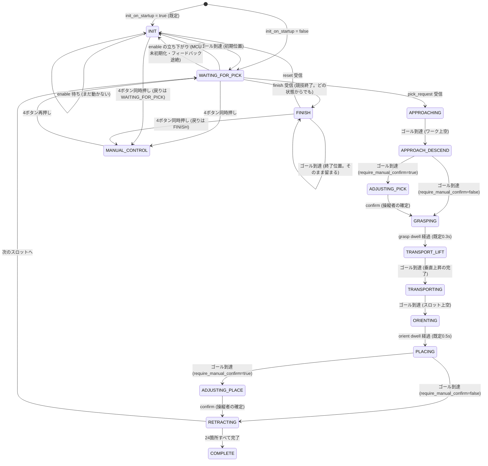

# game_state_manager_node

「掴む→運ぶ→置く→退避」の自動配置シーケンスと、ゲーム全体の状態を管理する中核ノード。
**実装済み** (`src/game_state_manager_node.cpp`)。状態遷移の純粋ロジックは
`include/sharmech_core/utility/game_state_machine.hpp` (`GameStateMachine`) に切り出してあり、
本ノードはそこへ ROS トピックの入出力を橋渡しするだけ。

全体アーキテクチャは [`sharmech/README.md`](../../README.md) を参照。

## 背景・やりたいこと

VR の仮想フィールドでオペレータがワークを「掴んで」「置きたい場所(仮想の置き場フィールド)」
へ置くと、実機は以下を自動で行う。

1. 選択されたワークの実姿勢へ接近する
2. グリッパを閉じて把持する
3. 安全な高さまで持ち上げて運搬する
4. `placement_order` の次のスロットの上空へ運び、到達したら「縦にする」指示を
   MCU へ送り、**箱へは降下せず**その高さで離して設置する
   (2026-09-11 ユーザー決定。`PLACING` は運搬高さのまま動かない)
5. 箱にぶつからない高さまで退避する
6. 次のスロットへ進み、1に戻る (24箇所すべて埋まったら完了)

シューティングボックスは4箱×6箇所=24箇所。**どの位置に何番目に置くか**を
`placement_order` (スロットIDの配列) で持ち、スロットIDごとの座標は
`slot_x/y/z_<color>` で持つ。**置く順番は `placement_order` だけで決まり、外部からの
「送り出してよい」の合図は要らない** (2026-09-13。下記「配置の順番」)。フィールドの色 (赤/blue) によってスロット座標が
異なるため、`field_color` は起動時に launch 引数で明示指定する
(詳細は下記「なぜ launch 引数を必須にするか」)。

## 役割

| 役割 | 詳細 |
|---|---|
| 状態管理 | `GameState` enum で管理し、`/catchrobo/game/state` (string, latched) に配信する |
| 自動シーケンス | 各状態1本の直線ゴールを `/catchrobo/arm/target_pose` へ順に publish する |
| 安全性 | ORIENTING〜PLACING の自動移動中だけ作業領域クランプをスロット周辺に一時的に絞る (ADJUSTING_PLACE に入った時点で解除) |

### やらないこと

| やらないこと | 担当 |
|---|---|
| 軌道生成・速度積分・作業領域クランプの実行・ウォッチドッグ | `motion_generator_node` (このノードは`/catchrobo/game/workspace_clamp`でクランプの範囲を指示するだけ) |
| UDP 送受信・MCU との通信 | `hardware_bridge_node` |
| ワークの検出・スキャン | `catchrobo_perception` (`cylinder_detector_node`)。本ノードはpick_requestで完成済みの姿勢を受け取るだけ |
| VR の仮想フィールド描画・オブジェクトの掴む/置く操作・向き変更用の「置き場フィールド」UI | **WebXR クライアント側**(別リポジトリ、実装は本ノードのスコープ外)。本ノードはそこから届くトピックの契約(下記)を満たすのみ |

## インターフェース

### Subscribe

| トピック | 型 | 説明 |
|---|---|---|
| `/catchrobo/game/pick_request` | `geometry_msgs/PoseStamped` | VR の仮想フィールドで選択したワークの姿勢。**`kWaitingForPick` 状態でのみ有効** |
| `/catchrobo/arm/status` | `sharmech_msgs/MotionStatus` | `motion_generator_node` の状態。`last_result` の変化でゴール到達/却下を検知する |
| `/catchrobo/game/toggle_manual_control` | `std_msgs/Empty` | `joy_teleop_node` が DualSense の4ボタン同時押しを検知して publish。**どの状態からでもトグルできる** (下記「自由操作」節) |
| `/catchrobo/game/reset` | `std_msgs/Empty` | 状態のリセット要求(VRメニューの「ステートリセット」)。**どの状態からでも** `kInit` へ入り、**初期位置 (`init_pose_*`) へ直線 1 本のゴールを出す** (2026-09-11〜。それ以前は MCU 側の初期関節角へ UDP bit2 で戻していた)。到達したら `kWaitingForPick` へ復帰する(下記「初期位置と状態のリセット」) |
| `/catchrobo/game/finish` | `std_msgs/Empty` | **競技終了時の終了位置への移動要求** (VRメニュー「本番」タブの「終了位置へ」。2026-09-13)。**導線は `reset` と同じ**: どの状態からでも `kFinish` へ入り、終了位置 (`finish_pose_*` の xy。**z は要求時点の目標姿勢のまま**) へ直線 1 本のゴールを出す。グリッパ開 + 縦解除 + クランプ解除も同時発行。動作許可が出ていれば**即**出し (`init_delay_sec` は待たない)、まだなら立ち上がり + `init_delay_sec` で出す。**着いても `kFinish` に留まる** (`kWaitingForPick` へは戻さない。下記「終了位置」節) |
| `/catchrobo/game/reset_progress` | `std_msgs/Empty` | **配置の進み具合のリセット** (VR メニューの「置き直す」。2026-09-13)。次に置くスロットを `placement_order` の先頭へ戻すだけで、**アームは動かさない** (ゴール・グリッパ・クランプを一切出さない)。運搬中 (`kApproaching`〜`kRetracting`) は無視する(下記「配置の進み具合のリセット」) |
| `/catchrobo/game/confirm` | `std_msgs/Empty` | **微調整の確定。** `kAdjustingPick` / `kAdjustingPlace` でのみ有効で、それ以外の状態では無視する。`joy_teleop_node` の確定ボタン (既定R3) と VR のサムズアップが、どちらもここへ publish する契約 |
| `/catchrobo/command/cartesian` | `sharmech_msgs/CartesianCommand` | `motion_generator_node` が `control_rate` (既定10Hz) で出す現在の目標姿勢と**動作許可 (`enable`)**。姿勢は**微調整でジョグした結果を知るために**購読し (publish はしない)、直後の垂直移動の起点に使う。`enable` の **false → true の立ち上がり**は「`motion_generator_node` が MCU の実姿勢へ同期し終えた = 動かしてよい」の合図で、`kInit` はこれを待ってから動き出す (2026-09-11 追加) |
| `/catchrobo/debug/change_state` | `std_msgs/String` | デバッグ専用。状態名 (`"APPROACHING"` 等) を受けて `forceState()` で強制的にその状態へ飛ばす。ゴール・グリッパ・クランプは一切 publish しない (その状態の見た目だけを確認したいとき用)。未知の状態名は無視して警告ログを出す |

`pick_request` の型を `PoseStamped` にしたのは、VR は既に `/catchrobo/field/cylinders`
(`cylinder_detector_node` の出力) から選んだ姿勢をそのまま持っているため。インデックス指定
方式にすると本ノードが検出結果を保持する必要が生じ、責務が増える。

### Publish

| トピック | 型 | 説明 |
|---|---|---|
| `/catchrobo/arm/target_pose` | `geometry_msgs/PoseStamped` | 自動シーケンスのゴール。**既存の VR/PS4 と同じトピックに直接 publish する**(下記)。**`INIT` の初期位置へのゴールもここから出る** (2026-09-11〜。専用の経路は持たない) |
| `/catchrobo/arm/gripper` | `std_msgs/Bool` | 自動シーケンスのグリッパ指令 |
| `/catchrobo/arm/orient_vertical` | `std_msgs/Bool` | PLACING 中のみ `true` |
| `/catchrobo/game/workspace_clamp` | `sharmech_msgs/WorkspaceClamp` | ORIENTING〜PLACING の作業領域クランプ上書きとその解除 (ADJUSTING_PLACE 入口 / RETRACTING 入口)。詳細は [`motion_generator_node.md`](motion_generator_node.md) |
| `/catchrobo/game/jog_limit` | `sharmech_msgs/JogLimit` | **微調整中 (ADJUSTING_*) のジョグ速度上限。** 下記「微調整中はジョグを遅くする」 |
| `/catchrobo/game/state` | `std_msgs/String` | 現在のゲームステート。**latched (transient_local)**、`state_publish_rate` (既定10Hz) |

### パラメータ

| パラメータ | 既定値 | 説明 |
|---|---|---|
| `field_color` | (既定値なし。**必須**) | `"red"` / `"blue"`。launch 引数 `field_color:=` で指定。他の値ならノード起動失敗 |
| `box_center_x_red` / `_blue` | CAD実測 | 各箱の中心X [m]。**配列の長さ = 箱の数。箱を動かしたらここを変える** |
| `box_center_y_red` / `_blue` | 0.5255 | 箱の中心Y [m] (全箱共通) |
| `slot_cols_x` / `slot_rows_y` | 2 / 3 | 箱内の格子。X方向(短辺)の列数 / Y方向(長辺)の行数 |
| `cylinder_diameter_m` | 0.071 | 缶の直径 [m]。CAD実測を正本 (スケッチ実測の66mm説が正しければ 0.066) |
| `slot_gap_x_m` / `slot_gap_y_m` | -0.002 / 0.014 | **★当日調整する主役。** 隣り合う缶の隙間 [m] (中心間距離 = 直径 + この値)。缶が当たるなら増やし、箱からはみ出すなら減らす |
| `box_inner_size_x_m` / `_y_m` | 0.138 / 0.255 | 箱の内寸 [m]。**はみ出し警告に使うだけで座標計算には入らない** |
| `slot_x_blue` / `slot_y_blue` / `slot_z_blue` | 2026-08-30確定 (X/Yのみ) | 青フィールドのスロット座標。`field`がロボット自身のベース座標系であることと「赤の線対称」という前提から、redと同じローカル数値になっている(下記) |
| `placement_order` | `[0..23]` (箱単位で埋める順) | 配置する順番のスロットID列。「ちょうど6個」ボーナスを狙うなら箱単位が既定として妥当 |
| `slot_clamp_margin_m` | 0.03 | ORIENTING〜PLACING中の作業領域クランプの片側マージン [m] (ADJUSTING_PLACE に入った時点で解除。2026-09-12) |
| `init_v_max_z` | 0.02 | **INIT の間だけ `motion_generator_node` の `v_max_z` に入れる z 速度上限 [m/s]** (2026-09-12 ユーザー指示。肘/膝機構は可動上限 z=0.2098 の近くを動くので初期位置へ戻るときだけ z をゆっくりに。r/θ は `v_max` のまま)。専用トピックではなく `ros2 param set` 相当 (`AsyncParametersClient`) で送り、INIT を抜けたら 0 (無効) に戻す。相手のサービスが無い起動直後は次の tick で再試行、動作許可の立ち上がり (= `motion_generator_node` の (再) 同期) でも入れ直す。ゴールは `init_delay_sec` 後に出るので先に届く |
| `require_manual_confirm` | true | true: 掴む直前・離す直前で止まり操縦者の確定を待つ / false: 止まらず完全自動。実機で位置合わせの精度が出るまでは true 推奨 |
| `box_top_z_m` | 0.156 | **高さの基準面。箱の上端の高さ [m]。当日実測して入れるのはこれ1個でよく、下の相対値がすべて追従する** |
| `pick_z_m` | 0.20 | **掴みに降りる先の絶対 z [m]。`pick_request` の z は常にこれで上書きする** (VR は缶オブジェクトの原点 = 底面 z=0 を送ってくるため、そのまま使うと z=0 まで降りる。2026-09-11 ユーザー指示)。`field_origin_offset_z_m` が足される。正本は `robot_geometry.yaml` の `work_placement.pick_z_m` |
| `slot_release_below_box_top_m` | 0.106 | スロット座標の z (基準面から何m下か)。**2026-09-11 以降 `PLACING` はここへ降下せず運搬高さで離すので、動作には使われない** (座標定義として残置) |
| `approach_clearance_above_box_top_m` | 0.044 | APPROACHING (空のグリッパ) で水平移動する高さ。基準面から何m上か (既定で絶対 z=0.20 相当)。**`retract_...` と同じ値にしておくこと** (揃っていれば退避高さのまま接近でき、接近が完全な水平移動になる) |
| `transport_clearance_above_box_top_m` | 0.044 | TRANSPORT_LIFT / TRANSPORTING (缶を保持) の高さ。同上 |
| `retract_clearance_above_box_top_m` | 0.044 | 設置後に上げる高さ。同上 |
| `field_origin_offset_z_m` | 0.0 | Z方向の平行移動 [m]。基準面の実測値はそのままに全体を上げ下げする逃げ道 |
| `grasp_dwell_sec` | 0.3 | GRASPING状態でグリッパを閉じてから待つ時間 [s] (グリッパの実フィードバックが無いための暫定措置。下記) |
| `orient_dwell_sec` | 0.5 | ORIENTING状態でワークを縦にし切るまで待つ時間 [s]。**ピッチ機構の速度が未実測なので0.5は仮値**。短すぎると缶が斜めのまま箱へ降下する (下記「縦にするタイミング」) |
| `state_publish_rate` | 10.0 | `/catchrobo/game/state` の配信周期 [Hz] |
| `init_pose_r_red` / `_blue` | 0.30 (仮値。コード上の `declare_parameter` 既定は 0.0 で、これは起動時に弾かれる) | **初期位置の r [m]。** ターンテーブル軸からの距離。**正本は `sharmech/params/robot_geometry.yaml` の `init_pose` セクション** (生成物 `robot_geometry.generated.yaml` 経由)。実行中に `ros2 param set` で変えられる (次の `INIT` から効く) |
| `init_pose_theta_red` / `_blue` | 0.0 (仮値) | 初期位置の θ [rad]。**+X から時計回りが正** (UDP と同じ向き。`docs/mcu_spec.md` §3.2/§5) |
| `init_pose_z_red` / `_blue` | 0.15 (仮値) | 初期位置の z [m] (ベース座標系)。**`field_origin_offset_z_m` は掛からない** (下記) |
| `turntable_axis_x_m` / `_y_m` | 0.0 / 0.0 (未実測) | 上の極座標の原点 = ターンテーブル回転軸の位置 [m]。`hardware_bridge_node` と同じ値が `robot_geometry.yaml` の `kinematics` から生成される |
| `init_on_startup` | true | true: 起動直後に `kInit` から始まり、動作許可が出て `init_delay_sec` 後に初期位置へ動く (**起動しただけでアームが動く**) / false: 従来どおり `kWaitingForPick` から始まる。**起動時にだけ読む** (`ros2 param set` では変えられない) |
| `init_delay_sec` | 3.0 | `kInit` で動作許可 (`enable`) が出てから、実際に初期位置へのゴールを出すまでの待ち [s] (2026-09-11 ユーザー指示。同期した瞬間に動き出さず一呼吸置く)。`reset` でも同じ。0 以上。実行中に変えられる (次の `INIT` から) |
| `finish_pose_r_red` / `_blue` | 0.15 (コード上の `declare_parameter` 既定は 0.0 で、これは起動時に弾かれる) | **終了位置の r [m]** (2026-09-13)。ターンテーブル軸からの距離。**正本は `robot_geometry.yaml` の `finish_pose` セクション** (生成物経由)。実行中に `ros2 param set` で変えられる (次の `finish` から効く) |
| `finish_pose_theta_red` / `_blue` | 0.0 | 終了位置の θ [rad]。`init_pose_theta_*` と同じ向き (+X から時計回りが正)。**z のパラメータは無い** (要求時点の目標姿勢の z を保つ。ユーザー指示 2026-09-12) |
| `field_origin_offset_x_m` / `_y_m` | 0.0 / 0.0 | 本番設置での原点ズレ補正 [m]。読み込んだスロット座標全体をこの分だけ平行移動する。`motion_generator_node` と同じ値を使う想定 |

> **名前について。** 本ドキュメントの状態遷移の説明に出てくる
> `approach_clearance_z` / `transport_clearance_z` / `retract_clearance_z` は
> `GameStateMachine::Config` の内部フィールド (**絶対高さ** [m]) を指す。
> ROS パラメータ側は 2026-09-06 に基準面からの相対
> (`*_above_box_top_m`) へ変わっており、内部の絶対値は
> `box_top_z_m + *_above_box_top_m + field_origin_offset_z_m` として組み立てられる。

### 微調整中はジョグを遅くする (2026-09-10)

`ADJUSTING_PICK` / `ADJUSTING_PLACE` に入っている間だけ、`/catchrobo/game/jog_limit` で
`motion_generator_node` のジョグ速度上限を `adjusting_jog_v_max` (既定 0.05 m/s) に絞る。
状態を抜けたら `reset = true` を送って起動時の上限へ戻す。

**変化した瞬間だけ publish する** (状態は `state_publish_rate` で回っているので毎回送ると無駄)。

状態ごとの扱い (`publishJogLimitIfChanged()` が正本):

| 状態 | ジョグ |
|---|---|
| `ADJUSTING_PICK` / `ADJUSTING_PLACE` | 上限を `adjusting_jog_v_max` (既定 0.05 m/s) へ絞る |
| `WAITING_FOR_PICK` / `MANUAL_CONTROL` / `COMPLETE` / `FINISH` / **`INIT`** | 許可 (`reset` = 起動時の `jog_v_max`) |
| 自動シーケンス中 (`APPROACHING`〜`RETRACTING`) | 遮断 (`block`) |

**`INIT` は 2026-09-13 に遮断から許可へ変えた** (ユーザー指示。`FINISH` と同じ扱いにする)。
自動シーケンスではなく「操縦者が居る場面」なので塞ぐ理由が無い。ただし実際に効く時間帯は
`goal_mode: goal_priority` の都合で限られる:

- **効く**: 動作許可が出てから `init_delay_sec` (既定 3s) 待っている間 (初期位置へ動き出す前に
  手で寄せられる)
- **効かない**: 初期位置へ動いている最中 (ゴール実行中は Twist が捨てられる。`FINISH` も同じ)。
  動作許可が出る前 (MCU 未同期・0x81 途絶中) は `motion_generator_node` が同期前の Twist を
  捨てるので、`reset` を送っても動かないことは変わらない
- 到達後は `WAITING_FOR_PICK` なので、そこから先は元々ジョグが効く

なぜこのノードがやるのか:

- **ゲームの状態を知っているのはこのノードだけ**だから。`motion_generator_node` は
  ゲーム進行を知らない輸送・生成層で、`/catchrobo/game/state` も購読していない。
  作業領域クランプ (`workspace_clamp`) と全く同じ構図
- **操縦層 (VR / PS4) に状態依存のロジックを置かなくて済む。** 以前は WebXR
  クライアントが ROS2 の状態名の一覧を持ち、状態ごとに速度倍率を掛けていた。
  ROS2 側が状態を1つ増やすたびにクライアント側の配列を手で直す必要があり、
  実際に `ADJUSTING_*` が漏れて微調整のジョグが出なくなる事故が起きた (2026-09-08)
- VR も PS4 もシミュレータも、何も変えずに同じ挙動になる

掴む/離す直前は缶に一番近く、行き過ぎるとワーク破損 (競技で-1点) に直結する。
`a_max` (既定 0.2 m/s²) があるので上限 0.05 m/s には 0.25 秒で到達し、以降は等速になる。
「倒した時間に比例して進む」予測しやすい挙動になり、離した後の滑りも 6mm 程度に収まる
(上限が高いと、倒し続けている間ずっと加速し続けて行き過ぎやすい)。

**実機の手感に合わせて `ros2 param set /game_state_manager_node adjusting_jog_v_max <値>`
で調整すること** (再起動不要。次に ADJUSTING へ入った時点から効く)。

### スロット座標の決まり方 (2026-09-06 に生成方式へ変更)

**24箇所の座標を直接書くのをやめ、箱の中心と缶の隙間から起動時に生成する。**
当日フィールドに合わなかったときに直す場所を最小にするための構成:

| 当日起きたこと | 直すパラメータ |
|---|---|
| 箱を動かした / 並べ方を変えた | `box_center_x_*` (箱の数もここで決まる) ・`box_center_y_*` |
| 缶同士が当たる / 箱に入らない | **`slot_gap_x_m` / `slot_gap_y_m`** |
| 高さが合わない | `box_top_z_m` (基準面。1個で全部追従) |
| フィールド全体がずれた | `field_origin_offset_x/y/z_m` |

**すべて実行中に `ros2 param set` で即反映できる (再起動不要)。**
不正な値は却下され、直前の設定のまま動き続ける。生成結果は起動時と変更時に
ログへ出る (格子の広がり vs 箱の内寸)。缶同士が重なる場合・箱をはみ出す場合は
警告が出るので、**当日その場で気づける。**

```
slot grid: 2x3/box, diameter=71mm, gap=(-2.0, 14.0)mm,
           span=(140.0, 241.0)mm vs box inner=(138.0, 255.0)mm, slot_z=0.050m
[WARN] 隣り合う缶が重なっています ...
[WARN] スロット格子が箱の内寸をはみ出しています ...
```

スロットIDは0始まりの通し番号で、箱ごとに「X列が外側・Y行が内側」の順
(箱0の (x0,y0),(x0,y1),(x0,y2),(x1,y0),(x1,y1),(x1,y2) → 箱1の…)。

**箱内の6個の並べ方そのものは未解決。** 既定値は箱の内寸を均等に2(X)×3(Y)分割した計算値
(詳細は `field_dimensions.md`)。なお**箱の位置自体はルール上 選手が自由に調整してよい**
ので、本番の並べ方を変えたら `sharmech/params/robot_geometry.yaml` の `shooting_box` も変えること
(2026-09-08〜。`config.yaml` には無い。手順は `sharmech/docs/parameter_tuning.md`)。実際のスロット配置が
分かり次第、この配列を差し替えること。

### なぜ `field_color` の launch 引数を必須にするか

**赤フィールドを中央線で線対称にしたものが青フィールド (ユーザー確認 2026-08-30、
2026-09-12 に Y 反転へ訂正)。** `field` 座標系はロボット自身のベース座標系なので X は
赤・青共通だが、線対称なので **Y は符号が反転する** (`box_center_y_blue = −0.5255`、
`init_pose_theta_blue = −init_pose_theta_red`。詳細は `sharmech/docs/field_dimensions.md`)。
2026-09-12 までは「同じローカル数値」としていたが、それは点対称 (180° 回して置く) の場合で
誤りだった。どちらの色で起動しているか取り違えると実機が Y 反対側の座標へ動こうとする
重大な事故につながるため、**config.yaml にも launch にもデフォルト値を置かず**、
起動のたびに `ros2 launch sharmech_bringup sharmech.launch.xml field_color:=red`
のように明示させる。

## ゲームステートと各状態での動作



**簡略化の注記:** `MANUAL_CONTROL`・`INIT`・`FINISH` は図では `WAITING_FOR_PICK` からのみ
描いているが、実際は `APPROACHING`/`GRASPING`/`TRANSPORTING`/`PLACING`/`RETRACTING`/
`COMPLETE` を含む**どの状態からでも**入れる。`MANUAL_CONTROL` はトグルし直すと
退避していたその状態へ戻る (`GRASPING` 中に入った場合は dwell タイマーも入れ直す)。
`INIT` は初期位置へ動いてから `WAITING_FOR_PICK` に復帰する (下記「初期位置と状態のリセット」節)。
全状態からの矢印を描くと読みにくくなるため、代表として1本にまとめている。
正確な条件は次の表を参照。

`INIT` に入った時点で動作許可 (`/catchrobo/command/cartesian` の `enable`) が出ていなければ
**ゴールを出さずに待ち** (図の自己遷移 `INIT --> INIT`)、立ち上がり (既に出ていれば `INIT` 突入)
から **`init_delay_sec` (既定 3s) 待って**初期位置へのゴールを 1 本出す (`tick` が予定時刻
`init_goal_due_sec_` を見て出す)。出したかどうかは `init_goal_sent_` (bool) で覚え、出す前に
届いた到達・却下は自分のものではないとして無視する。待ちの途中で `MANUAL_CONTROL` に入るか
`forceState` されたら予約は捨てる。

| # | 遷移 | 条件 | 備考 |
|---|---|---|---|
| 1 | `kWaitingForPick` → `kApproaching` | `pick_request` (PoseStamped) 受信 | 他の状態で受信しても無視 |
| 2 | `kApproaching` → `kApproachDescend` | `arm/status` の `last_result = SUCCEEDED` (ワーク上空に到達) | ここではまだ掴まない。真下へ降ろすゴールを発行する |
| 2b | `kApproachDescend` → `kAdjustingPick` | `last_result = SUCCEEDED` (降下完了) **かつ** `require_manual_confirm` | ゴールを出さず静止して待つ。この間ジョグで位置を微調整できる |
| 2c | `kAdjustingPick` → `kGrasping` | `/catchrobo/game/confirm` 受信 | グリッパ close を同時発行。`require_manual_confirm=false` なら 2b を飛ばして 2c 相当が直接起きる |
| 3 | `kGrasping` → `kTransportLift` | 経過時間 ≥ `grasp_dwell_sec` (既定0.3s) **かつ** `placement_order` に残りがある | grasp成功の実フィードバックは無い (下記「grasp判定が時間待ちである理由」)。**外部からの合図は待たない** (2026-09-13。下記「配置の順番」) |
| 3b | `kTransportLift` → `kTransporting` | `last_result = SUCCEEDED` (上昇完了) | 掴んだ場所の真上まで上がってから、水平移動に入る |
| 4 | `kTransporting` → `kOrienting` | `last_result = SUCCEEDED` (スロット上空に到達) | `orient_vertical=true` とクランプ絞りをここで発行 |
| 5 | `kOrienting` → `kPlacing` | 経過時間 ≥ `orient_dwell_sec` (既定0.5s) | ピッチ機構の実フィードバックは無い (下記「縦にするタイミング」)。ゴールは xy=スロット・z=`transport_clearance_z` (**降下しない**。実質その場) |
| 5b | `kPlacing` → `kAdjustingPlace` | `last_result = SUCCEEDED` **かつ** `require_manual_confirm` | ゴールを出さず静止して待つ。離す前に位置を微調整できる。**作業領域クランプを既定へ戻す** (`reset=true`) |
| 5c | `kAdjustingPlace` → `kRetracting` | `/catchrobo/game/confirm` 受信 | グリッパ open + 退避を発行 |
| 6 | `kPlacing` → `kRetracting` | `last_result = SUCCEEDED` | グリッパ open・クランプ解除を同時発行 |
| 7 | `kRetracting` → `kWaitingForPick` | `last_result = SUCCEEDED` かつ 未処理のスロットが残っている | 次のスロットへ進む |
| 8 | `kRetracting` → `kComplete` | `last_result = SUCCEEDED` かつ `placement_order` を使い切った | 全24箇所完了 |
| 9 | `kApproaching`/`kApproachDescend`/`kGrasping`/`kTransportLift`/`kTransporting`/`kOrienting`/`kPlacing`/`kRetracting`/`kInit`/`kFinish` → `kWaitingForPick` | `last_result = REJECTED`/`ABORTED` | 安全側フォールバック。`kWaitingForPick`/`kComplete`/`kManualControl` 中は対象外。グリッパを開き直す処理・ピッチを横へ戻す処理は無い (「既知の未対応」参照) |
| 10 | 任意の状態 ⇄ `kManualControl` | `/catchrobo/game/toggle_manual_control` | `kComplete` からも可。復帰時は退避先の状態へ。クランプは必ずデフォルトへ |
| 11 | 任意の状態 → 任意の状態 (デバッグ専用) | `/catchrobo/debug/change_state` | ゴール/グリッパ/クランプは一切publishしない。未知の状態名は無視+警告 |
| 12 | 任意の状態 → `kInit` | `/catchrobo/game/reset`、`init_on_startup=true` での起動、**`enable` の立ち下がり** (MCU 未初期化 bit3・フィードバック途絶 500ms) | `kManualControl`/`kComplete` からも可。グリッパ開 + 縦解除 + クランプ解除を同時発行する (起動時は初期状態なので何も出さない)。初期位置 (`init_pose_*`) へ**直線 1 本**のゴールを、動作許可 (`enable`) が出てから **`init_delay_sec` 後**に出す。**まだ出ていなければ出さずに待ち**、立ち上がり + `init_delay_sec` で出す。**配置の進み具合(`order_index_`)は消さない** (消すのは `reset_progress`) |
| 13 | `kInit` → `kWaitingForPick` | `last_result = SUCCEEDED` (ゴールを出した後のもの) | 初期位置に着くと、通常どおり `pick_request` を受けられる。却下・中断 (cancel) は #9 と同じ扱い。ゴールを出す前に届いた到達・却下 (途絶で中断された直前のゴールの結果、latched の古い status 等) は無視する |
| 14 | `kManualControl` → `kWaitingForPick` | トグル解除時に退避先が `kInit` だった | 自由操作は `INIT` の出口の 1 つ。戻ったときに途中だった初期位置への移動を再開しない |
| 15 | 任意の状態 → `kFinish` | `/catchrobo/game/finish` (2026-09-13) | **#12 と同じ導線。** `kManualControl`/`kComplete`/`kInit` からも可。グリッパ開 + 縦解除 + クランプ解除を同時発行し、終了位置 (`finish_pose_*` の xy + 要求時点の目標姿勢の z、pitch/yaw = 0) へ**直線 1 本**のゴールを出す。動作許可が出ていれば**即** (`init_delay_sec` を待たない)、まだなら立ち上がり + `init_delay_sec` で出す。**配置の進み具合は消さない** |
| 16 | `kFinish` → `kFinish` | `last_result = SUCCEEDED` (ゴールを出した後のもの) | 終了位置に着いた。**待機へは戻さず留まる** (競技は終わっているので `pick_request` を受ける状態にしない)。ゴールを出す前・着いた後に届いた到達・却下は無視する (#13 と同じ) |
| 17 | `kManualControl` → `kFinish` | トグル解除時に退避先が `kFinish` だった | `INIT` (#14) と違い**そのまま戻す** (着いた後の状態でもあるため)。戻ってもゴールは出さず、走っていたゴールの結果も無視する。却下・中断は #9 で `kWaitingForPick` へ |
| 18 | `kWaitingForPick` → `kWaitingForPick` (状態不変) | `pick_request` 受信、かつ `placement_order` を使い切っていて行き先スロットが無い | **掴みに行かず却下する** (2026-09-13)。ノードが警告ログを出す。再開は `/catchrobo/game/reset_progress` |
| 19 | `kComplete` → `kWaitingForPick` | `/catchrobo/game/reset_progress` (2026-09-13) | 進み具合を先頭へ戻したので、また掴める。**アームは動かさない**。`kManualControl` で受けた場合は復帰先が `kComplete` なら `kWaitingForPick` に直す |

**状態遷移の条件が変わったら、上の図と表を書き直すこと。** 正本は
[`game_state_machine.hpp`](../include/sharmech_core/utility/game_state_machine.hpp) と
[`game_state_manager_node.cpp`](../src/game_state_manager_node.cpp)。

| 状態 | 動作 |
|---|---|
| `kWaitingForPick` | 次に運ぶワークの選択待ち。`pick_request` を受理する |
| `kApproaching` | グリッパを開いたまま、選択されたワークの**真上**まで `approach_clearance_z` の高さで水平移動中 |
| `kApproachDescend` | ワークの真上から**垂直に降下**して掴む位置 (z = `pick_z_m`。`pick_request` の z は使わない) へ着ける |
| `kAdjustingPick` | **掴む直前の微調整待ち** (`require_manual_confirm=true` のときのみ)。ゴールを出さず静止し、操縦者がジョグで位置を合わせて確定するのを待つ |
| `kAdjustingPlace` | **離す直前の微調整待ち** (同上)。スロット上空 (運搬高さ) の姿勢のまま静止して待つ。入口で ORIENTING の作業領域クランプを解除する (位置の範囲制限なし) |
| `kGrasping` | 到達直後にグリッパを閉じ、`grasp_dwell_sec` だけ待つ(下記「grasp判定が時間待ちである理由」)。待ち終えたらそのまま次のスロットへ運び始める |
| `kTransportLift` | 掴んだ位置で `transport_clearance_z` まで**垂直に上昇**する |
| `kTransporting` | 高さを保ったまま、キュー先頭のスロットの**真上**まで水平移動中。到達したら `kOrienting` へ |
| `kOrienting` | **スロット上空で静止したまま**、`orient_vertical` を `true` にして横倒しのワークを縦にする。作業領域クランプもここでスロット周辺 (`slot_clamp_margin_m`) に絞る。**ゴールは発行しない** (下記「縦にするタイミング」) |
| `kPlacing` | スロット上空 (`transport_clearance_z`) のまま**降下しない**。ゴールは到達点と同じ高さなので実質動かず、到達で離す段へ進む (2026-09-11 ユーザー決定。以前はスロット姿勢まで降下していた) |
| `kRetracting` | グリッパを開き、同じ xy で `retract_clearance_z` まで直線で退避。作業領域クランプをデフォルトに戻す。**縦のまま抜く** (横へ戻すのは次の `kApproaching`) |
| `kComplete` | `placement_order` を使い切った。以降 `pick_request` は無視される(実質的な終了状態)。抜けるには `reset` かノードの再起動 |
| `kManualControl` | 自動シーケンス停止。**どの状態からでもトグルで入り、再度トグルで元の状態に戻る**(下記「自由操作」節) |
| `kInit` | 初期位置 (`init_pose_*`) へ **直線 1 本で動かしている最中**。グリッパは開・縦は解除・作業領域クランプはデフォルト。動作許可 (`enable`) が出るまでは動かずに待つ。到達したら `kWaitingForPick` へ(下記「初期位置と状態のリセット」節) |
| `kFinish` | 競技終了時の終了位置 (`finish_pose_*` の xy。z は要求時のまま) へ **直線 1 本で動かしている最中、および着いた後**。グリッパは開・縦は解除・クランプはデフォルト (`kInit` と同じ)。着いてもここに留まり、`pick_request` は受けない。**ジョグは許可** (`jog_limit` は `reset`。着いた後は自由操作へ入らなくても `cmd_twist` で動かせる。移動中は `goal_priority` がゴールを優先する)。出口は `reset`・`MANUAL_CONTROL`・却下/中断 (下記「終了位置」節) |

**すべての状態遷移のゴールは直線1本のみ。** 経由点を持つ軌道は作らない、という
`sharmech/README.md` の既存方針をこの自動シーケンスにもそのまま適用している。
「一旦上に上げてから横に動かす」ではなく、各状態の到達点への直線移動を状態ごとに
複数回積み重ねる形にした(現在の状態 → 次の状態の目標、を1本ずつ)。
**`kInit` だけは例外的に1つの状態の中で最大3本を順に出す** (到達するたびに次の1本。
`motion_generator_node` から見れば依然として直線1本ずつなので、方針は保たれている。
`/catchrobo/game/state` の観測者からは区間に関わらず `INIT` 1つに見える)。

## 配置の順番

**どのスロットへ置くかは `placement_order` の順番だけで決まる。** 掴んだら
`placement_order[order_index_]` のスロットへ運び、`kRetracting` を終えるたびに
`order_index_` が 1 つ進む。`order_index_` が `placement_order` の長さに達したら
`kComplete`。**外部から「送り出してよい」の合図を受ける仕組みは無い。**

**`placement_order` を使い切った後の `pick_request` は `kWaitingForPick` で却下する**
(`kComplete` から `reset` して掴み直した場合)。置き先が無いまま進めると、運搬先が
`pick_pose_` にフォールバックして**掴んだ場所へ缶を持ち帰って落とす**ため。
掴んでから待つのではなく掴みに行く前に止める。再開は `/catchrobo/game/reset_progress`
(下記)。`kGrasping` の側にも同じガードが残っており、**実行中の `ros2 param set` で
`placement_order` が縮んだ**場合はそこで待つ。

操縦者の関門は `kAdjustingPick` / `kAdjustingPlace` の確定 (`require_manual_confirm`)
が担う。掴む直前と離す直前の 2 箇所で止まるので、送り出しの合図を別に持つ必要が無い。

### 廃止した `/catchrobo/game/box_count` (2026-09-13)

それまでは VR が指定箱にワークを離すたびに送る**通算個数** (`box_count = N` →
`placement_order[N-1]`) を「置きに行くべきスロットのキュー」として扱い、
`kGrasping` はキューが空の間そこで待っていた。**これを廃止した理由:**

- VR 側のカウントはブラウザのメモリ上にしか無く、**ブラウザを再起動すると 0 に戻る**
  (`~/catchrobo_webxr_controller/src/index.js`)。メニューの「置き直す」(`resetSetup()`)
  でも 0 に戻るが、**どちらも `box_count` を publish しない**ので ROS2 側の消化済み個数
  (`order_index_`) だけが残る
- その状態で次に掴むと `box_count = 1` が届き、`order_index_` も 1 へ巻き戻されて
  キューが空 (`1 < 1` が偽) になり、**`kGrasping` から永久に進めなくなる**
  (2026-09-12 に実機で発生)
- `pick_request` を送れない PS5 単独運用では、そもそも `box_count` を送る手段が無く
  **構造的に `kGrasping` を抜けられなかった**

VR は今も `box_count` を publish しているが、**購読するノードが無いので無害**
(WebXR 側の修正は不要)。`placement_order` を使い切るまで置き続ける運用に変わった。

### 手動微調整 (`kAdjustingPick` / `kAdjustingPlace`)

掴む位置・離す位置は、perception の検出誤差・機構のたわみ・スロット座標の実測誤差が
そのまま乗る。**実機でどれだけずれるかが分かるまでは、人が最後に一目見て直せる**
ようにしてある (`require_manual_confirm: true`)。

| | 内容 |
|---|---|
| 止まる場所 | 掴む直前 (降下しきった位置) と、離す直前 (スロット上空・運搬高さの位置) |
| 止まり方 | **ゴールを発行しない。** アームはその場に留まる |
| 調整の入力 | ジョグ (`/catchrobo/arm/cmd_twist`)。VR・PS4 どちらでもよい |
| 再開 | `/catchrobo/game/confirm` (PS4の確定ボタン / VRのサムズアップ) |
| 位置の制限 | **無い。** `kAdjustingPlace` に入った時点で ORIENTING〜PLACING の作業領域クランプ (`slot_clamp_margin_m`) を既定へ戻す (`reset=true`)。`kAdjustingPick` はもともと絞っていない。効くのは速度上限 `adjusting_jog_v_max` (`jog_limit`) だけ。**2026-09-12 変更**: それまでは `enterRetracting()` まで解除が無く、WebXR で ADJUSTING_PLACE 中にスロット中心から ±30mm より外へ動かせなかった (微調整は操縦者が意図してジョグしているので範囲制限は要らない、というユーザー判断) |

**この状態ではジョグを入れても自動シーケンスが中断されない。** 通常、自動シーケンスの
移動中にゼロでない Twist が来ると `motion_generator_node` がゴールを abort し
(`goal_mode: "twist_priority"`)、本ノードは `kWaitingForPick` まで巻き戻る。
微調整中はそもそも**実行中のゴールが無い** (到達済みで `motion_generator_node` は
IDLE) ため、ジョグは単に目標姿勢をずらすだけで abort イベントが起きない。
特別な抑制ロジックを入れずに両立できているのはこのため。

調整した分は `/catchrobo/command/cartesian` (`control_rate`。2026-09-11 以降は既定10Hz) を購読して追跡し、
**直後の垂直移動 (`kTransportLift` / `kRetracting`) の起点に反映する。**
nominal の座標へ戻してしまうと、ずらした分だけ横に動く斜め移動になり、
L字分解の意味が無くなるため。

`require_manual_confirm: false` にすると2状態とも経由せず、従来どおり
到達した瞬間に掴む/離す。試合本番で時間が足りない場合はこちらへ切り替える
(180秒で24箇所を捌く必要があるため、確定待ちの人的レイテンシは無視できない)。

#### VR側の対応 (2026-09-08 実装済みを確認)

WebXR クライアントは両手サムズアップ / メニューの「確定」で `/catchrobo/game/confirm`
(`std_msgs/Empty`) を publish する。ROS2 側はトピックを購読するだけで、ジェスチャ認識は
持たない。PS4 の確定ボタンは `joy_teleop_node` で実装済み。

### 斜めに動かない (すべての移動を「垂直 → 水平 → 垂直」に分解する)

**このノードが出すゴールは、必ず「xyを変えない垂直移動」か「zを変えない水平移動」の
どちらかになっている。** 斜めの移動は1区間も無い。

| 区間 | 種類 | ゴール |
|---|---|---|
| `kApproaching` | 水平 | ワークの xy・`approach_clearance_z` |
| `kApproachDescend` | 垂直 | ワークの姿勢そのもの (xyはそのまま) |
| `kTransportLift` | 垂直 | 掴んだ位置の xy・`transport_clearance_z` |
| `kTransporting` | 水平 | スロットの xy・`transport_clearance_z` |
| `kPlacing` | 垂直 | スロット姿勢 (xyはそのまま) |
| `kRetracting` | 垂直 | スロットの xy・`retract_clearance_z` |
| `kInit` ① | 垂直 | 今いる xy・`retract_clearance_z` (2026-09-11 追加) |
| `kInit` ② | 水平 | 初期位置の xy・`retract_clearance_z` |
| `kInit` ③ | 垂直 | 初期位置そのもの (xyはそのまま) |

分解前は接近と運搬が斜めの1直線で、それぞれ次の問題があった。

- **接近が斜めに降りる**: 退避高さからワークへ一直線に降りるため、降下しながら
  横移動する区間ができる。ワークは200mmピッチで3行×6列に並んでいるので、
  **手前のワークを薙ぎ払う**経路になりうる
- **運搬が斜めに上がる**: 掴んだ直後に低い高さのまま横へ動き出すため、
  **缶を引きずる**、あるいは隣のワークに引っ掛ける

垂直と水平に分ければ、横移動は必ず `*_clearance_z` の高さで行われるので、
**その高さが障害物より高いことだけを確認すれば安全が保証できる** (斜め移動だと
経路上のどこで高さがいくつになるかを個別に検証しなければならない)。

経由点を持つ軌道は作らない、という既存方針は保たれている。**1つの状態が出すゴールは
依然として直線1本**で、L字は「状態を分けて直線を積み重ねる」ことで作っている
(`sharmech/README.md`「経由点についての注意」参照)。

**`approach_clearance_z` は `retract_clearance_z` と同じ値にしておくこと。**
揃っていれば `kRetracting` の到達高さのまま `kApproaching` に入れるので、接近が
完全な水平移動になる。揃っていないと、その差分だけ斜めになる (次のサイクルの
接近開始時に高さを合わせ直す状態は設けていない)。

**既知の限界**: 却下・中断からの復帰では、アームがどの高さに居るかに関係なく
`kApproaching` のゴールが出るので、最初の1本は「今いる高さ → `approach_clearance_z`」の
斜め移動になる。通常のサイクル中は `kRetracting` が必ず退避高さで終わるため発生しない。
**起動直後については 2026-09-11 の `INIT` (下記「初期位置と状態のリセット」) で改善した** ——
`init_on_startup: true` なら最初に初期位置の z で止まるので、そこが退避高さと
違えばその差分だけ斜めになる (どこに居るか分からない状態ではなくなった)。
なお `INIT` 自身の移動は**直線 1 本**で L 字にはしない (下記)。

### 縦にするタイミング (`kOrienting` を独立した状態にした理由)

ワークはフィールドに**横倒し**で置かれており、シューティングボックスには
**蓋を上にして縦**に入れる必要がある (「ちょうど6個・蓋が上向き」でボーナス)。
つまりピッチ機構で横→縦の90°回転をどこかで行う。

**以前は `kPlacing` に入る瞬間に `orient_vertical = true` を出していたが、これは
降下開始と回転開始が完全に同時になるため、回転が終わる前に缶が箱へ入る。**
箱は内寸138×255mm・深さ145mmに6スロットと狭く、斜めのまま突っ込めばほぼ確実に干渉する
(2026-09-05 に判明し、`kOrienting` を新設して解消)。

タイミングの候補と判定:

| タイミング | 判定 |
|---|---|
| `kGrasping` 直後 (掴んだ直後) | ✗ 低い位置で142mmの缶を立てるため、隣の缶・治具に干渉する |
| `kTransporting` 開始時 (移動しながら回す) | △ 時間は十分だが、縦になった缶は下端が下がる。箱・設置済みの缶との干渉が**Z方向未実測のため検証できない** |
| **スロット上空で静止して回す (採用)** | ◎ 移動しないので干渉しない。時間も確保できる |
| `kPlacing` と同時 (以前の実装) | ✗ 回転が間に合わず斜めのまま突入 |

`kOrienting` は**ゴールを発行しない**ので、アームは `kTransporting` の到達点
(スロット上空・`transport_clearance_z`) で静止したまま回転だけを行う。
構造としては `kGrasping` と同じ「静止したまま dwell を待つ」状態であり、
実フィードバックが無いため固定時間待ちにしている点も同じ。

Z方向の寸法が実測できたら、`kTransporting` 中に回して dwell を省く最適化が
可能になる (1サイクルあたり `orient_dwell_sec` ぶんの短縮)。現状は安全側に倒している。

### 戻り (縦→横) を `kRetracting` で行わない理由

`kRetracting` は箱から真上へ抜く動作なので、ここで横に戻すと**箱の中でグリッパを
回す**ことになり壁に当たりうる。縦のまま抜き、横へ戻すのは次の `kApproaching`
(空中の長い移動なので回転する時間も余裕もある) にしてある。
`onPickPoseReceived()` が `orient_vertical = false` を出す形で実現している。

## 自由操作 (VRが使えない場合の脱出ハッチ)

**最悪VRが動かせない場合でも、DualSense(PS4互換)コントローラだけで最低限
試合を進められるようにする**ための機能 (2026-08-31追加)。

- `joy_teleop_node` が4ボタン同時押し(既定 L1+R1+L3+R3。詳細は
  [`joy_teleop_node.md`](joy_teleop_node.md#自由操作トグル-vrが使えない場合の脱出ハッチ))を
  検知すると `/catchrobo/game/toggle_manual_control` を publish する
- 本ノードはこれを受けて `GameStateMachine::toggleManualControl()` を呼ぶ。
  **直前の状態を1つだけ覚えておき、`kManualControl` とその状態の間をトグルする**
  (`kComplete` からも入れる。試合終了後の片付けで手動操作したい場合もあるため)
- `forceState`(デバッグ用の状態強制遷移)と同様、目標姿勢・グリッパ・
  `orient_vertical` は一切 publish しない。**ジョグ操作(cmd_twist)は
  このトグルとは無関係に常に有効**なので、状態を変えるだけで操作自体は
  即座にできる
- **作業領域クランプだけは必ずデフォルトへリセットする。** `kPlacing` 中に
  絞り込まれたクランプが残ったままだと、脱出ハッチのはずがジョグ操作を
  妨げてしまうため
- `kManualControl` 中は、通常なら `kWaitingForPick` へ引き戻す
  `onGoalRejectedOrAborted`(ゴール却下・中断時の安全側フォールバック)が
  対象外になる。手動ジョグ中に何らかの理由でゴールが却下されても、
  自由操作状態から勝手に抜けてしまわないようにするため

### 既知の制限

自由操作中に人間が手動でワークを配置しても、スロットの消化 (`order_index_`)
はステートマシンには反映されない (センサでオブジェクトの状態を検知していないため)。
元の状態 (`kApproaching` 等) に戻ったとき、自由操作に入る前の時点でステートマシンが
把握していたスロット割付のまま自動シーケンスが再開される。これは既知の制限であり、
VR復旧後に不整合が疑われる場合は運用側で判断すること。

## 終了位置 (`FINISH`、2026-09-13)

ルールの「競技終了」(競技時間 3 分経過: 動作を停止し、審判の許可のもと**非常停止を
入れても安全な位置までロボットを移動させる**) に備え、アームを決まった位置へボタン 1 つで
寄せるための状態。VR のメニュー「本番」タブの「終了位置へ」が `/catchrobo/game/finish`
(`std_msgs/Empty`) を送り、本ノードが `GameStateMachine::requestFinish()` を呼ぶ。

**導線は `INIT` (`/catchrobo/game/reset`) の写し**で、違いは 2 点だけ。

| | `INIT` (`reset`) | `FINISH` (`finish`) |
|---|---|---|
| 入れる状態 | どこからでも | どこからでも (同じ) |
| 同時発行 | グリッパ開・縦解除・クランプ解除 | 同じ |
| ゴール | `init_pose` (r/θ/z)、pitch/yaw = 0 | `finish_pose` の xy + **要求時点の目標姿勢の z**、pitch/yaw = 0 |
| 出すタイミング | 動作許可の立ち上がり + `init_delay_sec` | 許可が出ていれば**即**。まだなら立ち上がり + `init_delay_sec` (同じ間) |
| 到達後 | `WAITING_FOR_PICK` へ | **`FINISH` のまま** |
| `MANUAL_CONTROL` からの戻り | `WAITING_FOR_PICK` | **`FINISH`** (ゴールは出さない) |
| 却下・中断 | `WAITING_FOR_PICK` (#9) | 同じ |
| z 速度の絞り (`init_v_max_z`) | 掛ける | 掛けない (z が動かない) |
| ジョグ (`jog_limit`) | **許可** (`reset`。2026-09-13〜。動作許可 + `init_delay_sec` の待ちの間に効く) | **許可** (`reset`。着いてから効く) |

- **行き先は `robot_geometry.yaml` の `finish_pose`** (`init_pose` と同じ極座標 r/θ、赤・青別。
  既定 r=0.15, θ=0 はユーザー指示 2026-09-12)。ノードが `PolarUtils` で直交座標へ直し、
  `field_origin_offset` は掛けない。**z は持たない** (ユーザー指示「z はまずは変えなくていい」。
  `/catchrobo/command/cartesian` で追っている現在の目標姿勢の z をそのまま使う。目標姿勢が
  未受信なら `init_pose` の z だが、動作許可と目標姿勢は同じメッセージで届くのでノード経由では起きない)
- **座標は VR に持たせない。** VR は「その状態へ遷移しろ」という空メッセージを送るだけで、
  `reset` と同じく `game/state` が `FINISH` に変わったことで届いたと判断し、変わらなければ再送する
- **着いても `WAITING_FOR_PICK` へ戻さない。** 競技は終わっているので `pick_request` を受ける
  状態にしない。次の試合・練習は `reset` (→ `INIT` → `WAITING_FOR_PICK`) から
- **ジョグは許可する** (`jog_limit` は待機・自由操作・完了と同じ `reset`。ユーザー指示
  2026-09-13)。着いた後、自由操作へ入らなくても VR / PS5 の `cmd_twist` でそのまま動かせる
  (審判の指示で位置を直す等)。**終了位置へ移動している最中は効かない** ——
  `motion_generator_node` の `goal_priority` がゴール実行中の Twist を捨てるため。
  移動を途中で止めたければ従来どおり `MANUAL_CONTROL` へ入る
- 掴んでいたワークは離す (`INIT` と同じ同時発行)。競技終了後なので得点には響かず、
  掴んだまま・縦のまま・クランプが絞られたままだと終了位置へ動けない/危ない方を避けた
- `enable` の立ち下がり (途絶) は `FINISH` からでも `INIT` へ (#12)。`/catchrobo/debug/change_state`
  で `FINISH` へ飛ばしても動かない (`forceState` はゴールを出さない)

## 初期位置と状態のリセット (`INIT`)

**初期位置は 2026-09-11 に ROS2 側へ移った。** それ以前 (2026-09-10) は MCU 側の
初期関節角が正本で、ROS2 は UDP `control_flags` bit2 を立てて頼み、到達を
`status_flags` bit5 で受け取るだけだった。現在は**このノードが行き先の座標を持ち、
普通のゴール (`/catchrobo/arm/target_pose`) として出す**。bit2 / bit5 は予約になり、
ROS2 は bit2 を常に 0 で送る (`sharmech/docs/mcu_spec.md` §3.2 / §4.6)。

### 行き先 (`init_pose_*`)

**正本は `sharmech/params/robot_geometry.yaml` の `init_pose` セクション**で、
`python3 sharmech/params/generate.py` が `robot_geometry.generated.yaml` へ
`init_pose_r_red` … の形で書き出す (手順は
[`parameter_tuning.md`](../../docs/parameter_tuning.md))。

- **UDP で MCU へ届くのと同じ極座標で持つ** —— 原点はターンテーブル軸
  (`turntable_axis_x_m` / `_y_m`)、θ は **+X から時計回りが正** [rad]、z はベース座標系 [m]。
  実機で「この関節角で止めたい」を決めるときに、フィードバックの r/θ/z をそのまま
  書き写せるようにするため (`docs/mcu_spec.md` §3.2/§5 と同じ約束)
- ノードが起動時に `PolarUtils` で直交座標へ直して `GameStateMachine::Config::init_pose`
  に入れる。変換結果は起動ログ (`game_state_manager_node started (… init_pose=(x, y, z) …)`) に出る
- **赤・青で別々**に持つ (フィールドの色で初期位置の場所が変わる)
- **`field_origin_offset_*` は掛からない。** 初期位置はロボット自身に対する姿勢であって、
  フィールドの設置誤差とは関係が無いため
- `r <= 0` や非有限値は**起動時に例外を投げてノード起動失敗** (fail-fast)。
  既定の 0.0 は「生成物が古くて値が入っていない」状態を意味する

### 動き方 (直線 1 本)

`kInit` に入ると、動作許可が出てから `init_delay_sec` (既定 3s) 待って初期位置へのゴールを
**1 本だけ** 出す (`GameStateMachine::scheduleInitGoal` → `tick` → `sendInitGoal`。pitch/yaw は 0)。他の状態のような「上げる → 水平 → 下ろす」の L 字分解は**しない**
(ユーザー決定 2026-09-11。シンプルさを優先)。箱の中や缶の列の間から斜めに抜けることに
なりうるが、**起動時は人間がおおよその初期位置にアームを置いてから電源を入れる運用で
カバーする**。試合中の `reset` / 途絶からの復帰で周囲に当たりそうなときは、先に
`MANUAL_CONTROL` のジョグで抜いてから `reset` を押す。

### 起動時も同じ経路を通る (`init_on_startup`、2026-09-11)

**`init_on_startup: true` (既定) なら、ノードは `kWaitingForPick` ではなく `kInit` から
始まる。** ただし**すぐには動かない**。`motion_generator_node` が MCU のフィードバックへ
目標姿勢を同期し終えて `/catchrobo/command/cartesian` の `enable` を false → true に
立ち上げた瞬間に、初期位置へのゴールを出す (それ以前の目標姿勢は原点の仮値なので
軌道の始点に使えない)。

```
起動 → INIT (enable 待ち、動かない)
     → MCU が 0x81 を返す → motion_generator が同期 → enable が立つ
     → INIT (init_delay_sec = 3s 待つ) → INIT (初期位置へ直線 1 本) → 到達 → WAITING_FOR_PICK
     → 最初の pick_request → APPROACHING → … → RETRACTING → WAITING_FOR_PICK (2 回目以降は INIT に戻らない)
```

`INIT` の出口は 3 つ: 到達 (→ `WAITING_FOR_PICK`)、`MANUAL_CONTROL` へのトグル (戻りは
`WAITING_FOR_PICK`)、却下・中断 (→ `WAITING_FOR_PICK`)。`pick_request` は `INIT` 中は
受けない (到達後の `WAITING_FOR_PICK` で受ける)。

### フィードバック途絶で強制 `INIT` (`enable` の立ち下がり、2026-09-11)

**`enable` が true → false に落ちたら、どの状態からでも `kInit` に入る** (ユーザー決定)。
`motion_generator_node` は MCU 未初期化 (bit3) と**フィードバック途絶** (`hardware_bridge_node`
の `feedback_timeout`、既定 500ms → `mcu_status.connected=false`) の両方で同期を取り消して
`enable=false` にするので、ケーブル抜け・MCU 再起動のどちらでもここを通る。
このときグリッパは開ける (`reset` と同じ同時発行)。ワークを保持したまま途絶すると
落とすことになるが、承知の上で単純さを優先した。ゴールは出さずに待ち、復帰して
`motion_generator_node` が実姿勢へ同期し直し `enable` が立ち上がった瞬間に初期位置へ動く。

途絶で中断された直前のゴールの `ABORTED` は `enable` の立ち下がりと前後して届くが、
`kInit` でゴールを出す前に届いた却下・中断・到達は無視するので、どちらが先でも `INIT` に留まる。

**起動しただけでアームが動く**ので、起動時に WARN を1本出している
(`INIT on startup: the arm will move to the init pose as soon as motion is enabled`)。
初期位置の値を実機で決める前の初回試験など、動かしたくない場合は
`config.yaml` の `game_state_manager_node.init_on_startup: false` にする
(この場合でも `/catchrobo/game/reset` の `INIT` は使える)。

### リセット (`/catchrobo/game/reset`)

**`/catchrobo/game/reset` (`std_msgs/Empty`) を受けると、どの状態からでも `kInit` に
入り、初期位置へ直線 1 本で戻る。** 到達したら `kWaitingForPick` へ復帰し、
そのまま次の `pick_request` を受けられる。送るのは VR クライアント
(`catchrobo_webxr_controller`) の操作メニューにある「ステートリセット」ボタン。

`kInit` に入るとき、状態と一緒に次を同時発行する。**手順が途中で崩れたときに、
アームを既知の姿勢へ戻して安全に仕切り直す**ためのもの。

| 同時発行するもの | 値 | 理由 |
|---|---|---|
| `target_pose` | 初期位置 (pitch/yaw = 0) | 直線 1 本。**同時ではなく `init_delay_sec` 後** (`tick`)。動作許可がまだなら立ち上がりを待つ (2026-09-11。それ以前は `init_request` (Empty) を1回出すだけでゴールは出さなかった) |
| `gripper` | `false` (開) | ワークを掴んだままリセットされると、その後どこで落ちるか分からない |
| `orient_vertical` | `false` (横) | 縦のまま広い範囲を動かさない |
| `workspace_clamp` | `reset = true` | `kOrienting`〜`kRetracting` の絞り込みが残っていると初期位置へ戻れない |

- **`kManualControl` からも入れる。** リセットは VR のボタンなので、押せている時点で
  VR は生きている (`kManualControl` は「VRが使えないときの脱出ハッチ」)。
  自由操作から引き出して初期位置へ戻す方が、ボタンが無反応になるより分かりやすい
- **却下・中断されたときは #9 と同じ扱い**で `kWaitingForPick` へ落ちる。
  理由はノードが警告ログに出す (初期位置が作業領域の外で `goal outside workspace` に
  なった場合など)
- **`kInit` から `kManualControl` へ入って戻ると `kWaitingForPick`** (途中だった移動を
  再開しない。自由操作は `INIT` の出口の 1 つ)
- **配置の進み具合 (`order_index_`) は消さない。** 巻き戻すと、既に缶が入っている
  スロットへもう一度置きに行くことになる。配置ごとやり直したいときはノードを上げ直す
- **`/catchrobo/debug/change_state` で `INIT` へ飛ばしても初期位置へは動かない**
  (`forceState` はゴールを出さない)。実際に動かすのは `reset` だけ

### 配置の進み具合のリセット (`/catchrobo/game/reset_progress`、2026-09-13)

**`order_index_` を 0 に戻す専用の合図** (`std_msgs/Empty`)。VR のメニューの
「置き直す」(`resetSetup()`) から送る。VR 側でワークを並べ直したのに ROS2 側の
進み具合が残っていると、次に掴んだ缶を途中のスロットへ運んでしまう
(それまでは**ノードを上げ直すしか戻す手段が無かった**)。

- **アームは動かさない。** ゴール・グリッパ・クランプを一切出さない。`reset` (`INIT`)
  との使い分けは「姿勢を戻すのが `reset`、進み具合を戻すのが `reset_progress`」
- 受け付けるのは**運搬中でない状態だけ**: `kWaitingForPick` / `kComplete` / `kInit` /
  `kFinish` / `kManualControl`。運搬中 (`kApproaching`〜`kRetracting`) に行き先スロットが
  変わると、`kOrienting` で絞ったクランプと `kPlacing`/`kRetracting` のゴールが食い違うため
  無視する (警告ログを出す)
- `kComplete` で受けたら `kWaitingForPick` へ戻す (行き先ができたので掴める)。
  `kManualControl` で受けて復帰先が `kComplete` なら、復帰先も `kWaitingForPick` にする
- **行き先スロットが無い状態の `pick_request` は `kWaitingForPick` で却下する**
  (掴みに行ってから `kGrasping` で待たない)。ログに「`reset_progress` を送れ」と出る

## grasp 判定が時間待ちである理由

MCU からのフィードバックパケット (`packet_type = 0x81`) には `gripper_state` フィールドが
既に存在するが、`hardware_bridge_node` は現状これをどの ROS2 トピックにも publish していない
(`current_pose` / `joint_states` のみ)。実際にグリッパが閉じたことを確認する手段が無いため、
**`grasp_dwell_sec` の固定時間待ちという暫定実装にしてある。** グリッパの実フィードバックが
ROS2 側で使えるようになったら、時間待ちを「実際に閉じたことの確認」に置き換えるべき。

## 自動シーケンスと `/catchrobo/arm/target_pose` の関係

自動シーケンスのゴールは、**専用チャンネルを新設せず既存の `/catchrobo/arm/target_pose`
にそのまま publish する。** VR/PS4 と同じ「調停なし・早い者勝ち」の前提に乗る形になる。

これは検討の末の選択で、代替案として「`motion_generator_node` に自動シーケンス専用の
優先入力チャンネルを追加する」も検討したが、以下の理由で見送った。

- `motion_generator_node` に手を入れずに済み、パターンA/Bのどちらでも変更不要という
  既存の設計方針([`motion_generator_node.md`](motion_generator_node.md) 参照)を維持できる
- 自動シーケンス実行中に人間が手動ジョグを送っても効かないことは、当初 VR 側 UI の
  責務としていたが、**2026-09-10 に ROS2 側へ移した** (`/catchrobo/game/jog_limit` の
  `block`。「ジョグの速度制限と場面ごとの抑止」節)。手動ゴール (`target_pose`) は
  `goal_priority` の調停で実行中のゴールが優先される。操縦層に状態依存のロジックは置かない

ただし「UI の契約だけに頼る」のは事故時の保険として弱いため、**ORIENTING〜PLACING の
自動移動中だけ作業領域クランプをスロット周辺に動的に絞る**ことで、仮に人間の手動ゴールが
紛れ込んでも遠方へは物理的に動けないようにしている。`kAdjustingPlace` に入った時点で
既定へ戻す (微調整に範囲制限は掛けない。2026-09-12。`require_manual_confirm=false` なら
`kRetracting` 入口で戻す) (詳細は
[`motion_generator_node.md`](motion_generator_node.md) の「作業領域クランプの動的上書き」)。

## 内部状態 (`GameStateMachine`)

ROS に依存しない純粋ロジックとして `utility/game_state_machine.hpp` に実装し、
`test/test_game_state_machine.cpp` (gtest) で検証している。

| 状態変数 | 説明 |
|---|---|
| `state_` | 現在の `GameState` |
| `order_index_` | `placement_order` の何番目を処理中か |
| `pick_pose_` | 直近の `onPickPoseReceived` で受け取った姿勢 |
| `grasp_start_sec_` | `kGrasping` に入った時刻。dwell判定に使う |
| `pre_manual_state_` | `kManualControl` に入る直前の状態。トグルで戻すために1つだけ覚えておく |
| `current_pose_` | `/catchrobo/command/cartesian` で追っている現在の目標姿勢。微調整後の垂直移動の始点に使う |
| `motion_enabled_` | 直近の動作許可 (`enable`)。未受信なら false。**false → true の立ち上がり**で `kInit` のゴールを出し、**true → false の立ち下がり**で `kInit` へ入る (2026-09-11 追加) |
| `init_goal_sent_` | `kInit` で初期位置へのゴールを出したか。出す前に届いた到達・却下は無視する (同上) |
| `init_goal_due_sec_` | `kInit` でゴールを出す予定時刻 (動作許可が出た時刻 + `init_delay_sec`)。予約が無ければ `nullopt` |
| `finish_goal_sent_` | `kFinish` で終了位置へのゴールを出したか (着いたら false)。出す前・着いた後に届いた到達・却下は無視する (2026-09-13) |
| `finish_goal_due_sec_` | `kFinish` で動作許可待ちのままゴールを出す予定時刻。予約が無ければ `nullopt` |
| `pending_*` | 状態遷移の直後にのみセットされる「まだ publish していない指令」。ノード側が読んで publish したら消費(consume)する (edge-triggered) |

`pending_*` を edge-triggered にしているのは、**同じゴールを毎周期 publish すると
`motion_generator_node` 側で軌道が再生成され続けて永久に到達しなくなる**ため
(`onTargetPose` は新しいゴールを受理するたびに現在地から軌道を作り直す)。

## 異常系

| 事象 | 挙動 |
|---|---|
| `kWaitingForPick` 以外で `pick_request` を受信 | 無視 |
| 自動シーケンスのゴールが却下・中断された (`RESULT_REJECTED` / `RESULT_ABORTED`) | 警告ログを出し、`kWaitingForPick` へ戻る(下記「既知の未対応」)。**`kManualControl` 中は対象外** (自由操作から勝手に抜けないようにするため) |
| `field_color` が `red`/`blue` 以外、または未指定 | 起動時に例外を投げてノード起動失敗 (fail-fast) |
| `slot_x/y/z_<color>` が空または長さ不一致 | 同上 |
| `placement_order` が空、または範囲外のIDを含む | 同上 |
| `finish_pose_r_<color>` が 0 以下 / 非有限、`theta` が非有限 | 同上 (2026-09-13 追加)。既定の 0.0 のまま = 生成物が古い |
| `init_pose_r_<color>` が 0 以下 / 非有限、`theta`/`z` が非有限 | 同上 (2026-09-11 追加)。既定の 0.0 のまま = `robot_geometry.generated.yaml` が古いか読まれていない。メッセージに `generate.py` の実行を促す一文が入る |
| `kInit` で動作許可 (`enable`) がいつまでも立たない | **`INIT` のまま待ち続ける** (ゴールを出さないのでアームは動かない)。MCU が 0x81 を返していないか、bit3 (未初期化) が落ちていない。`ros2 topic echo /catchrobo/arm/mcu_status` で確認する |
| 動作許可 (`enable`) が true → false に落ちた (MCU 未初期化・フィードバック途絶 500ms) | **どの状態からでも `kInit` へ** (グリッパ開・縦解除・クランプ解除)。復帰して `enable` が立ち上がると初期位置へ動く (2026-09-11) |

### 既知の未対応

ゴールが却下・中断された場合、現在 `kPlacing` や `kRetracting` の途中でも一律
`kWaitingForPick` へ戻す。**グリッパを開き直す処理をしていない**ため、たとえば
`kPlacing` 中に却下されると「ワークを掴んだまま次の `pick_request` を待つ」状態に
なりうる。作業領域クランプを絞ったことによる意図しない却下は起きにくい設計だが、
発生した場合はオペレータが目視で気づいて手動介入する前提。将来グリッパの実フィードバックが
使えるようになったら、状態ごとの復帰処理(グリッパを開く、等)を追加すべき。

## 設計判断

全体に関わる判断は [`sharmech/README.md`](../../README.md) を参照。ここでは本ノード固有のものを記す。

### Action を使わない

`sharmech/README.md` および `motion_generator_node.md` に記載の「Action を使わない」方針を
そのまま踏襲した。自動シーケンスの実行中/完了/却下は `/catchrobo/arm/status.last_result` の
変化で検知でき、Action の feedback/result に相当する役割を既存の状態トピックが果たせている。

VR の再スキャン(10秒毎 + 手動ボタン)についても同様の理由で Action は使わず、
`catchrobo_perception` 側でトピック (`~/rescan_request`) + latched な結果トピックの
組み合わせにしてある。詳細は `catchrobo_perception/README.md` を参照。

### 状態遷移ロジックをノードから分離する (`GameStateMachine`)

`TrapezoidalTrajectory` と同様、ROS に依存しない純粋ロジックとして切り出すことで
gtest だけで状態遷移を検証できるようにした。ノード (`game_state_manager_node`) は
ROS トピックとの薄い橋渡し層に徹する。

### スロット座標を赤/青で独立した配列にする (ミラー計算にしない)

「フィールドの座標系原点はロボットのベース座標系」という既存原則([`sharmech/README.md`](../../README.md)
の「座標系」参照)により、`field_color` が変わっても座標変換自体は不要 (TFを増やさない)。
一方でスロット座標の**値そのもの**は、単純な軸反転で赤→青に変換できるかが CAD 未確認のため
分からない。誤ったミラー公式を組み込むより、素直に独立した配列として持たせ、実測値が
揃った時点でそれぞれ個別に埋める方が安全と判断した。

## テスト

`sharmech_core/test/test_game_state_machine.cpp` (gtest, ROS非依存) が状態遷移一式
(1スロットの完全なサイクル、pick の状態ガード、合図なしで `kGrasping` を抜けること
(キューが空の間は `kGrasping` で待つ・0リセット/飛び/クランプへの追従・
確定済みサイクルを中断しないこと・`kComplete` からの復帰)、却下時の復帰、完了判定、
`kOrienting` の待機動作 (dwell 未経過では降下ゴールを出さずその場に留まること・
`kRetracting` では縦のまま抜き次の `kApproaching` で横へ戻すこと)、
`kManualControl` のトグル・任意の状態からの出入り・クランプの強制リセット・
却下イベントの無視) を検証する。**2026-09-11 に `INIT` の一式を追加した**:
`init_on_startup` で `kInit` から始まること・動作許可が立つまで動かないこと・
立ち上がりから `init_delay_sec` 後に初期位置 (pitch/yaw = 0) へのゴールが 1 本出ること (それまでは出ないこと・待ちの途中の `MANUAL_CONTROL` で予約が消えること)・`enable` が true のまま
来ても再発火しないこと・`kInit` 以外での立ち上がりでは何も起きないこと・`reset` からの
ゴール発行と動作許可待ち・**`enable` の立ち下がりでどの状態からでも `kInit` へ入り
グリッパを開くこと・その前後に届く古い到達/却下を無視すること**・到達で
`kWaitingForPick` へ戻ること・`kManualControl` へ入って戻ると `kWaitingForPick` に
なること・`forceState(kInit)` では動かないこと・却下時の復帰・配置の進み具合を消さないこと。
**2026-09-13 に `FINISH` の一式を追加した**: どの状態からでも入り即ゴールが出ること
(xy = `finish_pose`・z = 現在の目標姿勢・pitch/yaw = 0、グリッパ開・縦解除・クランプ解除)・
着いても `kFinish` に留まり `pick_request` を無視すること・動作許可待ちなら立ち上がり +
`init_delay_sec` で出ること・目標姿勢未受信時の z のフォールバック・`kManualControl`/`kComplete`
からも入れること・却下で `kWaitingForPick` へ落ちること・`reset` で `kInit` へ抜けること・
`kManualControl` の往復で `kFinish` へ戻り動かないこと・`forceState(kFinish)` では動かないこと・
配置の進み具合を消さないこと・状態名の往復。
`test_motion_generator_node.cpp` には `/catchrobo/game/workspace_clamp` の上書き・reset・
**フィードバック途絶での同期取消 (enable=0・ゴール ABORTED・復帰後の再同期)**・
長さ 0 のゴールで NONE → SUCCEEDED の両方が届くことの回帰テストがある。
自由操作トグルは実際に `sharmech.launch.xml` を起動し、`/joy` へ4ボタン同時押しを
模擬した `sensor_msgs/Joy` を publish して `/catchrobo/game/state` が
`MANUAL_CONTROL` ⇄ 元の状態を往復することを手動確認済み (2026-08-31)。
ノードとしての自動結合テスト(`game_state_manager_node` を実際に起動して
`motion_generator_node` と繋げる)は未実装。

**mock_mcu での E2E は、2026-09-11 の直線 1 本 + 途絶 INIT への作り直し後は未実施**
(`mock_mcu.py --power-on-pose` で電源投入位置を与えて確認する。手順は
`docs/match_runbook.md` の起動確認と同じ)。

## 未決定事項

| 項目 | 内容 |
|---|---|
| **初期位置 (`init_pose`) の値** | `robot_geometry.yaml` の `r/θ/z` は赤・青とも `status: estimate` の仮値 (0.30, 0.0, 0.15)。**実機で決める手順は [`parameter_tuning.md`](../../docs/parameter_tuning.md)「初期位置を実機で決める手順」。** 青は赤の θ を符号反転した値 (2026-09-12)。極座標の原点 (`turntable_axis_x/y_m`) は未実測 (0.0) だが、**極座標で持っているので後から軸の実測値を入れても初期位置の物理的な場所は変わらない** (`hardware_bridge_node` が同じ原点で極座標へ戻すため。変わるのは ROS2 内の直交座標の値と、作業領域クランプとの関係だけ) |
| シューティングボックスの箱内6スロットの正確な位置 | 箱の外形(赤フィールド)は実測確定。箱内の割付は均等分割の計算値 (`field_dimensions.md` 参照) |
| 青フィールドの実測 | 青は「赤の線対称 (X 共通・Y 反転)」の計算値のみ。青で試合する前に箱の位置を実測して `center_x/y_blue` を確認すること |
| グリッパの実フィードバック | `hardware_bridge_node` が UDP の `gripper_state` を publish していないため、grasp判定が時間待ちの暫定実装のまま |
| **ピッチ機構の回転速度** | `orient_dwell_sec` の 0.5 は仮値。実機のピッチ機構が横→縦を回し切る時間を実測して詰めること。短すぎると缶が斜めのまま箱へ降下し、長すぎると1サイクルあたりそのぶん試合時間を失う (24箇所×0.5s = 12s) |
| ピッチの実フィードバック | 0x81 にピッチの実状態を返すフィールドが無いため、`kOrienting` も grasp と同じ固定時間待ち。将来 MCU が返せるようになったら、グリッパとまとめて実確認へ置き換える |
| 却下・中断時の復帰処理 | グリッパを開き直す・ピッチを横へ戻す等、状態ごとのリカバリが未実装 (上記「既知の未対応」) |
| ~~VR側の `pick_request` 送信ロジック~~ | **2026-09-05 解消を確認。** WebXR クライアントは掴んだワークで `pick_request` を送り `target_pose` は送らない (二重送信の競合も同時に解消)。同時に送っていた `box_count` は 2026-09-13 に購読をやめたので無視される |
